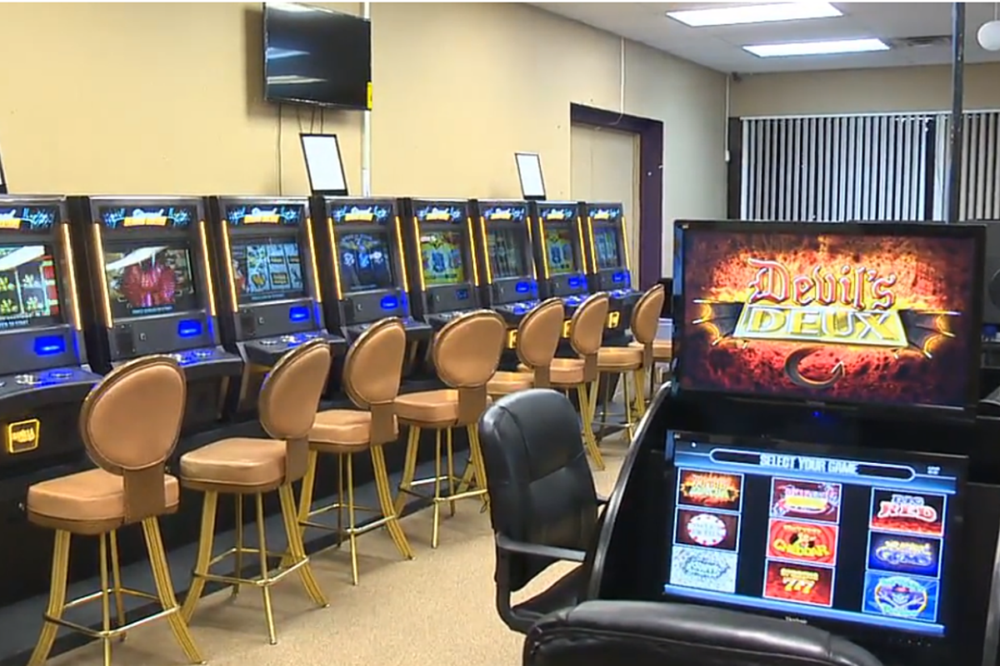
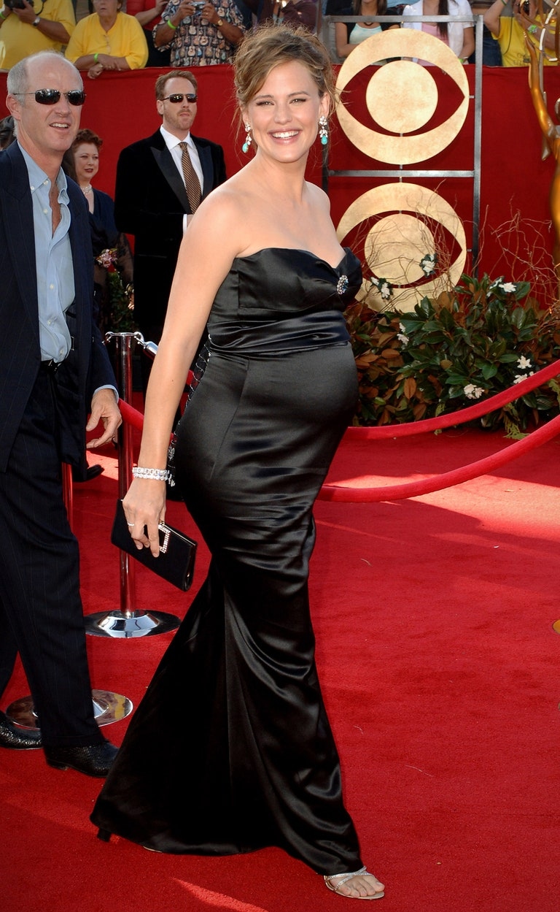
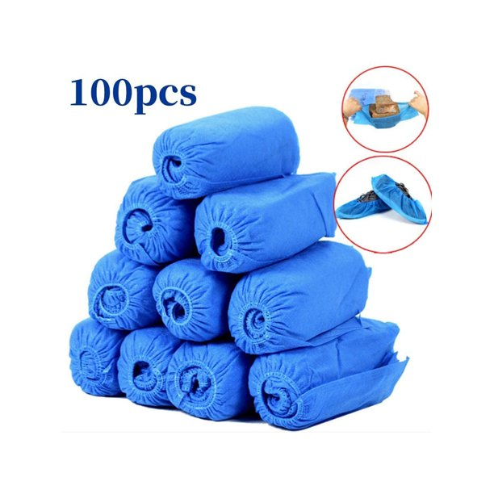

# A-B

## a glass half-full

You're such a glass half-full kind of guy. 你真是个乐观的人啊。

反义：a glass half-empty

## abdomen

[ˈæbdəmən]

*n.*
腹部; [虫]腹部; 下腹; 腹腔

- He was suffering from pains in his abdomen. 他感到腹部剧痛。
- Definition of **baby bump**: the enlarged abdomen of a pregnant woman

## address

This is addressed to Mrs. Braverman downstairs! 收件人是楼下的布雷曼太太

## adultery

 \ ə-ˈdəl-t(ə-)rē \

voluntary sexual intercourse between a married person and someone other than that 
person's current spouse or partner

## airborne

[ˈerbɔːrn]

*adj.*
升空的，飞行中的; 空气传播的; 空降的; 在空气中的

airborne disease 空气传播的病

## alienate

[ˈeɪliəneɪt]

v.
使疏远，离间; 使不友好

It's the people's fault and the government's fault that alienated to China

## ambush

[ˈæmbʊʃ]

n.
埋伏; 伏击; 伏击者，伏兵; 伏击点

vt.
伏击

Quick! Someone's ambushed our Guardians.

## ample

[ˈæmpl]

adj.
大量的; 充裕的; （身材）丰满的

There is ample parking. 停车位挺足

[大爆炸片段](https://www.ixigua.com/7005167121772741133)

## anecdotal

[ˌænɪkˈdoʊtl]

*adj.*
传闻的; （含）轶事的

Anecdotal evidence suggests that in the game of rock-paper-scissors, 
players familiar with each other will tie 75 to 80% due to the limited number
of outcomes. \
传闻有证据表明在剪刀石头布中，如果让互相熟悉的玩家进行一定局数的较量，那么其中75到80%会平局收场。

## anticlimactic

[ˌæntɪklaɪ'mæktɪk]

adj.
突降法的，渐减的; 虎头蛇尾的

Just ... feels a little anticlimactic.

[大爆炸片段](https://www.ixigua.com/7005167121772741133)

## apple of my eye

In modern English, the phrase "apple of my eye" indicates something or someone that one 
values above all others. 

## apron

[ˈeɪprən]

n.
围裙; 〈航〉 停机坪

Oh, you're losin'your apron here, let me get it.

* Oh, hey.
* Hey.
* Tie my apron, will you? 
* My pleasure.

## arcade

[ɑrˈkeɪd]

n.
游戏机。商场，游乐中心; 拱廊，连拱廊; 有拱廊的街道

- Spending hours at the arcade

## aroma

[əˈroʊmə]

n.
芳香，香味; 气派，风格

a distinctive, typically pleasant smell.

#### Fragrant. Term applied to wines with pronounced and pleasing aroma.

## at stake

*adv.*
危如累卵，危险\
濒于险境，处于成败关头

There was a lot at stake.

## authentic

[ɔːˈθentɪk]

adj.
正宗的; 真正的; 真诚的; 逼真的; 可靠的

would you say this is pretty authentic 非常正宗

## awkward

[ˈɔːkwərd]

adj.
使人尴尬的; 棘手的; 难使用的; 不方便的; 危险的; 难携带的; 笨拙的; 别扭的; 害羞的; 不可理喻的; 难相处的

That was awkward, right?

[大爆炸片段](https://www.ixigua.com/7005047812476011016)

## baby bump

Definition of baby bump
: the enlarged abdomen of a pregnant woman

- Jennifer Lawrence debuted her baby bump on the red carpet Sunday night 
(December 5) at the New York City premiere of her movie Don't Look Up.

## baby fever

Baby fever is the intense and sudden desire to have children, even if you’re single or know 
that you’re not yet ready. Researcher Gary Brase says it best: “Baby fever is this idea out 
in popular media that at some point in their lives, people get this sudden change in their 
desire to have children. While it is often portrayed in women, we noticed it in men, too.”

Yes! You want babies! You have baby fever!

## banging body

['bænɡɪŋ]

n.
凹凸有致的身材

I mean, look at you. Your body is bangin'!

[大爆炸片段](https://www.ixigua.com/7010030799319892493)

## barrel in(to)

[ˈbærəl]

1. To enter some place abruptly or aggressively, or force one's way into a place or thing.
    * He just barreled into the meeting with no warning.
    * Don't barrel in here talking loudly—this is a church!
    * Hurricane Ida, barreling into the Louisiana coast overnight, the 
    devastation in the region felt throughout small towns, many without the kind of
    infrastructure New Orleans built up after hurricane Katrina.
2. To collide with someone or something.
    * There's a dent in the garage door from when my son barreled into it with his bike.
    * I rounded the corner and nearly barreled into Tara.

参见：
- [wgno.com](https://wgno.com/tracking-ida/breaking-hurricane-ida-now-a-category-4-storm/)
- [跟艾伦一起学英语](https://www.ixigua.com/7002284326100402724)

## bachelor pad

a typical apartment of an unmarried man\
单身公寓

## be cool

- Be cool. Everything will be all right. 冷静一点, 一切都会没问题的.
- Oh , be cool about it . It is just a mirage. 不要那么激动, 只不过是海市蜃楼而已.
- Be cool, be cool, be cool. （装成啥都没发生的样子）

参见：
- [大爆炸片段](https://www.ixigua.com/7055609424315941413)

## beefy

[ˈbifi]

*adj.*
壮实的；牛肉似的; 结实的，肌肉发达的

- Wei is pretty beefy individual 伟有相当壮实的体型

## blanch

[blæntʃ]

*vt.*
焯水

briefly immerse (an item of food) in boiling water, especially as a technique for 
removing the skin from nuts or fruit or for preparing vegetables for further cooking.

- I really learned from your cooking, Jay, 
that in Chinese cooking you need to blanch a lot of things

## blend

\[blend\]

*v.*
（使）混合; 融合，结合; 协调\
*n.*
融合; 混合（物）

- Choose curtains that blend in with your decor.\
挑选和装饰格调一致的窗帘。
- No, I want to blend in\
不行，我得入乡随俗

## body odor

*n.*
体臭; 狐臭

## boner / booboo

[ˈboʊnə(r)] / ['bubu]

n.
愚蠢的错误 / 〈俚〉愚蠢的错误

* It was quite the boner. 那真是蠢不可耐
* Oh, gosh, golly, I made a boo-boo. 天啊，犯了个蠢错

## booties covers / shoes covers / disposable boot and shoe covers

## bosom

[ˈbʊzəm]

n.
胸部，乳房; 衣服的胸襟; 家庭般的温暖; 胸怀

## bow out

[bo aʊt]

躬身送（某人）出门; 放弃做（某事）; 退出

If it was me, and this is just me, I would bow out.

[老友记片段](https://www.ixigua.com/7009618240964035086)

## brag

[bræɡ]

*v.*
吹嘘，夸耀

Actually, what you're doing is pretending to complain, 其实你是假抱怨\
but really trying to brag. 真显摆。

## brain juice

The knowlage found in someones mind that may be exercised of them like juice from an orange.

（类似）心灵鸡汤(Chicken Soup for the Soul, Boost Your Brain Power!)

## broil

烤

- I need that broiling pan that Joey borrowed the other day.
我来要回乔伊上次借的烤盘

[老友记片段](https://www.ixigua.com/7059729127900709407)

## brown-nose

*v.*
拍马屁，谄媚

*verb* 
To try to curry favor with someone through flattery or favors in the hopes 
of getting something in return.
- I'm not doing well at all in math this year, so it seems like brownnosing 
the teacher is my only hope for a good grade!
- Don't brownnose me with chocolates and sweet talk\
just tell me what you want!

## brunt

[brʌnt]

n.
（来自攻击一方的）主要力量; 撞击，进攻; 冲击

bear the brunt

## buck teeth

龅牙

## buttery

[ˈbʌtəri]

ADJECTIVE

containing or tasting like butter.
- "layers of flaky buttery pastry"
- synonyms:
    - creamy · fatty · heavy · full-flavored

covered with butter.
- "buttery fingers"
- synonyms:
    - greasy · fatty · swimming in oil/fat · oleaginous

[老友记片段](https://www.ixigua.com/7051888411879473695)
