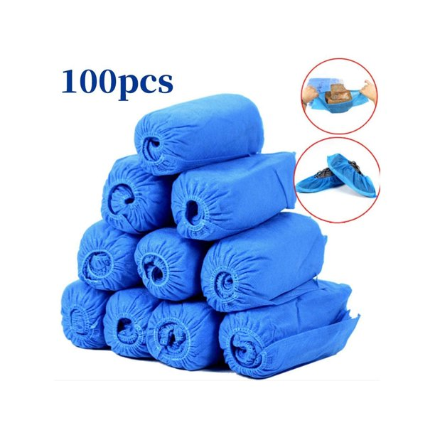

# A-C

## a glass half-full

You're such a glass half-full kind of guy. 你真是个乐观的人啊。

反义：a glass half-empty

## alienate

[ˈeɪliəneɪt]

v.
使疏远，离间; 使不友好

It's the people's fault and the government's fault that alienated to China

## ambush

[ˈæmbʊʃ]

n.
埋伏; 伏击; 伏击者，伏兵; 伏击点

vt.
伏击

Quick! Someone's ambushed our Guardians.

## ample

[ˈæmpl]

adj.
大量的; 充裕的; （身材）丰满的

There is ample parking. 停车位挺足

[大爆炸片段](https://www.ixigua.com/7005167121772741133)

## anticlimactic

[ˌæntɪklaɪ'mæktɪk]

adj.
突降法的，渐减的; 虎头蛇尾的

Just ... feels a little anticlimactic.

[大爆炸片段](https://www.ixigua.com/7005167121772741133)

## apple of my eye

In modern English, the phrase "apple of my eye" indicates something or someone that one 
values above all others. 

## apron

[ˈeɪprən]

n.
围裙; 〈航〉 停机坪

Oh, you're losin'your apron here, let me get it.

* Oh, hey.
* Hey.
* Tie my apron, will you? 
* My pleasure.

## aroma

[əˈroʊmə]

n.
芳香，香味; 气派，风格

a distinctive, typically pleasant smell.

#### Fragrant. Term applied to wines with pronounced and pleasing aroma.

## authentic

[ɔːˈθentɪk]

adj.
正宗的; 真正的; 真诚的; 逼真的; 可靠的

would you say this is pretty authentic 非常正宗

## awkward

[ˈɔːkwərd]

adj.
使人尴尬的; 棘手的; 难使用的; 不方便的; 危险的; 难携带的; 笨拙的; 别扭的; 害羞的; 不可理喻的; 难相处的

That was awkward, right?

[大爆炸片段](https://www.ixigua.com/7005047812476011016)

## baby fever

Baby fever is the intense and sudden desire to have children, even if you’re single or know 
that you’re not yet ready. Researcher Gary Brase says it best: “Baby fever is this idea out 
in popular media that at some point in their lives, people get this sudden change in their 
desire to have children. While it is often portrayed in women, we noticed it in men, too.”

Yes! You want babies! You have baby fever!

## banging body

['bænɡɪŋ]

n.
凹凸有致的身材

I mean, look at you. Your body is bangin'!

[大爆炸片段](https://www.ixigua.com/7010030799319892493)

## barrel in(to)

[ˈbærəl]

1. To enter some place abruptly or aggressively, or force one's way into a place or thing.
    * He just barreled into the meeting with no warning.
    * Don't barrel in here talking loudly—this is a church!
    * Hurricane Ida, barreling into the Louisiana coast overnight, the 
    devastation in the region felt throughout small towns, many without the kind of
    infrastructure New Orleans built up after hurricane Katrina.
2. To collide with someone or something.
    * There's a dent in the garage door from when my son barreled into it with his bike.
    * I rounded the corner and nearly barreled into Tara.

[wgno.com](https://wgno.com/tracking-ida/breaking-hurricane-ida-now-a-category-4-storm/)

[跟艾伦一起学英语](https://www.ixigua.com/7002284326100402724)

## boner / booboo

[ˈboʊnə(r)] / ['bubu]

n.
愚蠢的错误 / 〈俚〉愚蠢的错误

* It was quite the boner. 那真是蠢不可耐
* Oh, gosh, golly, I made a boo-boo. 天啊，犯了个蠢错

## shoes covers / booties covers / disposable boot and shoe covers

## bosom

[ˈbʊzəm]

n.
胸部，乳房; 衣服的胸襟; 家庭般的温暖; 胸怀

## bow out

[bo aʊt]

躬身送（某人）出门; 放弃做（某事）; 退出

If it was me, and this is just me, I would bow out.

[老友记片段](https://www.ixigua.com/7009618240964035086)

## brain juice

The knowlage found in someones mind that may be exercised of them like juice from an orange.

（类似）心灵鸡汤(Chicken Soup for the Soul, Boost Your Brain Power!)

## brunt

[brʌnt]

n.
（来自攻击一方的）主要力量; 撞击，进攻; 冲击

bear the brunt

## canvas

[ˈkænvəs]

n.
帆布; 油画（布）

a canvas bag

Love is a canvas furnished by nature and embroidered by imagination.
爱是一幅油画,背景是大自然,并为想像力所点缀.

The show includes canvases by masters like Carpaccio, Canaletto and Guardi.
画展上有卡尔帕乔、卡纳莱托和瓜尔迪等大师们的油画作品

## carve

[kɑːrv]

v.
雕刻; 切下（肉片） ; 开创（事业）; 铺（路）

- Shall I carve? 可以开切了吗？
- By all means. 当然可以

[老友记片段](https://www.ixigua.com/7010279669651997198)

## cheap shot

n.
恶意中伤，恶意攻讦; 暗算

That was a cheap shot. 这招很贱.

## Chinese throwing stars

## chubby

[ˈtʃʌbi]

adj.
胖乎乎的，圆胖的，丰满的

It's like the perfect kind of chubby 它(大熊猫)就像是那种完美的可爱丰满

## claustrophobia

[ˌklɔstrəˈfoʊbiə]

n.
幽闭恐怖

## cleavage

[ˈklivɪdʒ]

n.
分裂; [胚] 卵裂; 乳沟

Mary's gown exposes too much cleavage.

## compulsory

[kəmˈpʌlsəri]

adj.
强迫的; 义务的; 规定的

## constipation

[ˌkɑnstɪˈpeɪʃn]

n.
<医>便秘; 受限制

Another thing I've got which I was quite surprised about
was I got constipation

## crotchless

[krɑtʃ]

开裆的；无裆的

These jeans are too tight in the crotch. \
The child was sitting on a crotch of a tree.\
You can't make crotchless panties?

## crucial

[ˈkruːʃl]

adj.
至关重要的，关键性的

For dynamic memory allocation, pointers are crucial.

## cuddly

[ˈkʌdli]

cuddly dog 粘人的狗

## curb

[kɜːrb]

v.
控制，抑制; 约束，限定\
n.
马路边；起控制（或限制）作用的事物\
an edging (as of concrete) built along a street to form part of a gutter.

