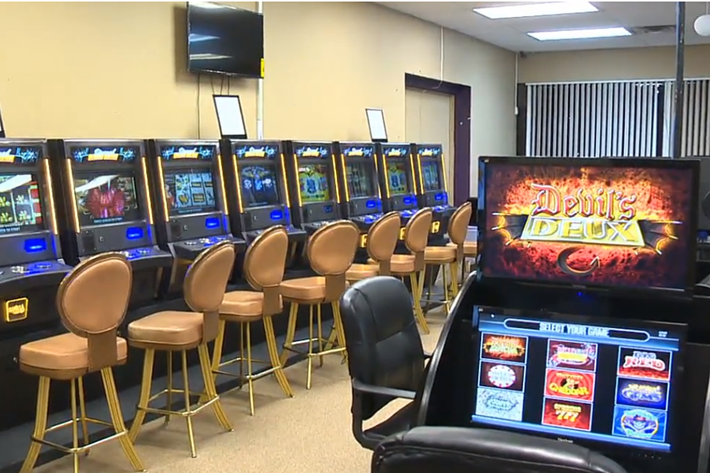

# A

## a glass half-full

You're such a glass half-full kind of guy. 你真是个乐观的人啊。

反义：a glass half-empty

## abdomen

[ˈæbdəmən]

*n.*
腹部; [虫]腹部; 下腹; 腹腔

- He was suffering from pains in his abdomen. 他感到腹部剧痛。
- Definition of **baby bump**: the enlarged abdomen of a pregnant woman

## address

This is addressed to Mrs. Braverman downstairs! 收件人是楼下的布雷曼太太

## adulation

[ˌædʒəˈleɪʃn]

*n.*
谄媚，称赞，奉承

- The true hero doesn't seek adulation.\
真正的英雄不寻求奉承。（幕后英雄不邀功）

## adultery

 \ ə-ˈdəl-t(ə-)rē \

voluntary sexual intercourse between a married person and someone other than that 
person's current spouse or partner

## airborne

[ˈerbɔːrn]

*adj.*
升空的，飞行中的; 空气传播的; 空降的; 在空气中的

airborne disease 空气传播的病

## alienate

[ˈeɪliəneɪt]

v.
使疏远，离间; 使不友好

- It's the people's fault and the government's fault that alienated to China

## allergic

[əˈlɜːrdʒɪk]

*adj.*
过敏的; 反感的，厌恶的\
informal
(allergic to)
having a strong dislike for:
- Jason's allergic to being ignored. He can't sit still. \
Jason 极度反感被人忽视。他坐不住。

## ambush

[ˈæmbʊʃ]

n.
埋伏; 伏击; 伏击者，伏兵; 伏击点

vt.
伏击

Quick! Someone's ambushed our Guardians.

## amount to anything

to turn out to be (something or someone important, impressive, etc.)

- I don't think he'll ever amount to anything.
- We are not certain that this argument amounts to anything more than 
the assertion that the State has the right to control the moral content 
of a person's thoughts.

## amount to nothing

1. To fail to become successful or significant.
    - He got arrested so much as a teenager that I thought he would 
    amount to nothing, but look at him now — he's an accomplished musician!

2. To result in no tangible or appreciable difference.
    - I worked really hard on my pitch, but it all amounted to 
    nothing — the company went with a different ad agency.

## ample

[ˈæmpl]

adj.
大量的; 充裕的; （身材）丰满的

There is ample parking. 停车位挺足

[大爆炸片段](https://www.ixigua.com/7005167121772741133)

## anecdotal

[ˌænɪkˈdoʊtl]

*adj.*
传闻的; （含）轶事的

Anecdotal evidence suggests that in the game of rock-paper-scissors, 
players familiar with each other will tie 75 to 80% due to the limited number
of outcomes. \
传闻有证据表明在剪刀石头布中，如果让互相熟悉的玩家进行一定局数的较量，那么其中75到80%会平局收场。

## anticlimactic

[ˌæntɪklaɪ'mæktɪk]

adj.
突降法的，渐减的; 虎头蛇尾的

Just ... feels a little anticlimactic.

[大爆炸片段](https://www.ixigua.com/7005167121772741133)

## apartment complex

小区

## apple of my eye

In modern English, the phrase "apple of my eye" indicates something or someone that one 
values above all others. 

## apricity

*n.*
The warmth of the Sun in winter.

## apron

[ˈeɪprən]

n.
围裙; 〈航〉 停机坪

Oh, you're losin'your apron here, let me get it.

* Oh, hey.
* Hey.
* Tie my apron, will you? 
* My pleasure.

## arcade

[ɑrˈkeɪd]

n.
游戏机。商场，游乐中心; 拱廊，连拱廊; 有拱廊的街道

- Spending hours at the arcade

## armpit

[ˈɑrmpɪt]

*n.*
腋窝; 胳肢窝

## aroma

[əˈroʊmə]

n.
芳香，香味; 气派，风格

a distinctive, typically pleasant smell.

#### Fragrant. Term applied to wines with pronounced and pleasing aroma.

## pain in the ass

*n.*
令人讨厌、憎恨，指人是眼中钉、肉中刺

- Pain in the ass. 烦死了。

## at stake

*adv.*
危如累卵，危险\
濒于险境，处于成败关头

There was a lot at stake.

## authentic

[ɔːˈθentɪk]

adj.
正宗的; 真正的; 真诚的; 逼真的; 可靠的

- would you say this is pretty authentic 非常正宗
- We just came to one of the more 我们刚刚来到一个 \
supposedly authentic restraunts in the city 据说是城里很正宗的中餐馆

## awkward

[ˈɔːkwərd]

adj.
使人尴尬的; 棘手的; 难使用的; 不方便的; 危险的; 难携带的; 笨拙的; 别扭的; 害羞的; 不可理喻的; 难相处的

That was awkward, right?

[大爆炸片段](https://www.ixigua.com/7005047812476011016)

