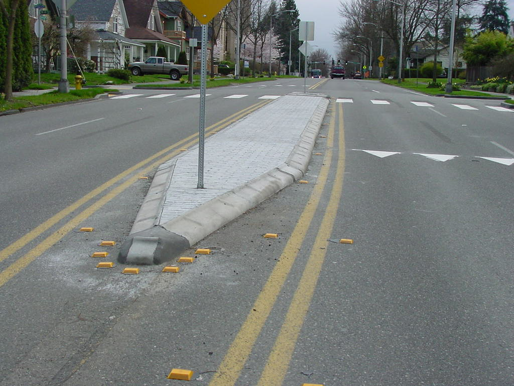

# C

## canvas

[ˈkænvəs]

n.
帆布; 油画（布）

a canvas bag

Love is a canvas furnished by nature and embroidered by imagination.
爱是一幅油画,背景是大自然,并为想像力所点缀.

The show includes canvases by masters like Carpaccio, Canaletto and Guardi.
画展上有卡尔帕乔、卡纳莱托和瓜尔迪等大师们的油画作品

## carpentry

[ˈkɑrpəntri]

n.
木工手艺，木匠业

carpentry workshop 木工工坊

## cart vs kart

How to use the word CART/KART?

In American English, "kart" refers to a very small race car, often called a "go-kart". 
"Cart" is used for everything else. Because "cart" and "kart" are pronounced the same, 
the context has to provide the meaning in conversation.

"Cart" has so many possible meanings that it is usually preceded by another word to 
describe the type of cart. Examples include golf cart, shopping cart, hand cart, horse 
cart, go-kart, utility cart, tool cart, computer cart, luggage cart, ice cream cart, 
food cart, and beverage cart.

## carve

[kɑːrv]

v.
雕刻; 切下（肉片） ; 开创（事业）; 铺（路）

- Shall I carve? 可以开切了吗？
- By all means. 当然可以

[老友记片段](https://www.ixigua.com/7010279669651997198)

## cheap shot

n.
恶意中伤，恶意攻讦; 暗算

That was a cheap shot. 这招很贱.

## cheesy

[ˈtʃizi]

*adj.*
有干酪味的; 劣质的; 虚伪的

It's getting kind of cheesy, Leonard. 越说越烂俗了哦，莱纳德。

[大爆炸片段](https://www.ixigua.com/7038878014192648711)

## chill out

1. *slang* To become calmer; to calm down. This phrase is often used as an imperative.
2. *slang* To relax.

## Chinese throwing stars

## chippy

[ ˈtʃɪpi]

*Slang* A woman prostitute.

No, because he's in love with the British chippy! 不会，因为他爱那个英国贱货！

[老友记片段](https://www.ixigua.com/7033656022572991012

## chubby

[ˈtʃʌbi]

adj.
胖乎乎的，圆胖的，丰满的

It's like the perfect kind of chubby 它(大熊猫)就像是那种完美的可爱丰满

## claustrophobia

[ˌklɔstrəˈfoʊbiə]

n.
幽闭恐怖

## clean slate

A fresh start; another chance after wiping out old offenses or debts. 
This idiom often appears as **wipe the slate clean**.

An opportunity to start fresh despite past mistakes or problems.
- I know we've had our differences, but I'd like to repair our friendship. Can we start 
over with a clean slate?
- I really appreciate you giving me a clean slate after I failed that first test.

## cleavage

[ˈklivɪdʒ]

n.
分裂; [胚] 卵裂; 乳沟

Mary's gown exposes too much cleavage.

## compulsory

[kəmˈpʌlsəri]

adj.
强迫的; 义务的; 规定的

## conglomerate

[kənˈglɑmərət]

n.
联合大企业; 砾岩; 合成物; 组合物

The only losers are the big cheesecake conglomerate "Mama's Little Bakery".

[老友记片段](https://www.ixigua.com/7051888411879473695)

## constipation

[ˌkɑnstɪˈpeɪʃn]

n.
<医>便秘; 受限制

Another thing I've got which I was quite surprised about
was I got constipation

## crack the top ...

- 10 college football teams that can crack the top 25 and make some noise in 2021
- Don't even crack the top ten. 甚至都没进前十

## cracker

[ˈkrækər]

NOUN
1. a thin, crisp wafer often eaten with cheese or other savory toppings.
2. a person or thing that cracks.
3. US
offensive \
another term for **poor white**.

It had a buttery, crumbly, graham cracker crust with a very rich yet light cream cheese filling.

[老友记片段](https://www.ixigua.com/7051888411879473695)

## crotchless

[krɑtʃ]

开裆的；无裆的

These jeans are too tight in the crotch. \
The child was sitting on a crotch of a tree.\
You can't make crotchless panties?

## crucial

[ˈkruːʃl]

adj.
至关重要的，关键性的

For dynamic memory allocation, pointers are crucial.

## crumbly

[ˈkrəmblē]

consisting of or easily breaking into small fragments.
- "the cheese is crumbly and moist"
- synonyms:
    - brittle · breakable · friable · powdery · granular · short · crisp · crispy · pulverulent · brashy

[老友记片段](https://www.ixigua.com/7051888411879473695)

## crust

[krʌst]

n.
面包皮; （馅饼）酥皮; 硬层; 地壳

## cubicle

[ˈkjubɪkəl]

*n.* 隔断

Wow! It's huge! It's so much bigger than the cubicle. 哇！好大呀！比小隔断大多了。

## cuddly

[ˈkʌdli]

cuddly dog 粘人的狗

## curb

[kɜːrb]

v.
控制，抑制; 约束，限定\
n.
马路边；起控制（或限制）作用的事物\
an edging (as of concrete) built along a street to form part of a gutter.

