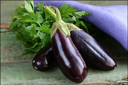

# D-E

## dairy

[ˈderi]

*n.*
乳制品
*adj.*
牛奶的，乳制的; 乳品业的

See, bottom shelf: meats and dairy. 看，底层放肉类及乳制品。

## decent

[ˈdiːsnt]

adj.
像样的; 得体的; 正派的

- Assuming that you have a decent understanding of C#, getting started 
in WPF isn't too difficult.
- I need a decent night's sleep.
\
我需要好好地睡上一夜。
- That dress isn't decent. \
那件连衣裙不够雅观。
- Uh, uh, okay, hold on, I'm not decent! 好的，稍等。我有点衣冠不整。

## detour

[ˈdiːtʊr]

v.
绕路，绕道

n.
绕道; 弯路

A PennDOT spokesperson says it's because of an embankment slide, 
but that means that people who use that road everyday will 
have to take a 20-mile detour.

## dial it down or ramp it down

<https://english.stackexchange.com/questions/502556/dial-it-down-or-ramp-it-down>

What is the meaning of the last sentence? How do you relate it with previous 
sentences? I should explain in advance that the writer is addressing a speaker 
who is giving his or her lecture in front of the audience on the stage.

> A good rule of thumb is to keep your facial expression consistent with your 
> ideas. You can have big ideas - they're only listening to you, after all. 
> You may feel the need to keep your face neutral, which is boring, in a conversation 
> about your ideas, but don't forget, you're the only one up there. Represent your 
> ideas. If they're big, be big. It's easier to dial it down than ramp it up.

In the context of advice about whether to show animation while giving a speech, the sentence

> - It's easier to dial it down than ramp it up.

means that moving from extreme animation to less animation is easier to do than becoming 
more animated after showing little animation at first. The meaning is conveyed by metaphor.

*Dial down* and *ramp up* are phrasal verbs, which take pronoun objects between the verb and 
its particle. The object -- *it* -- refers to the same thing in each case -- animation while 
speaking -- and the opposition of up and down as particles for the phrasal verb shows that 
they are opposites.

They are also both metaphors, and not the same metaphor, which makes it confusing.

*Dial* refers to a volume knob on an old radio or stereo (supplanted by icons to press on 
newer equipment). Turning the knob, or dial, raised or lowered the sound volume. Dialing it 
up raises the volume (this is an UP/DOWN metaphor), and dialing it down lowers it.

A *ramp*, on the other hand, is a tilted surface for movement vertically. To *ramp up* 
something is to increase its height, which may simply mean providing a larger number, as here.

Consequently both *turn up* and *ramp up* have much the same meaning in this context, as do 
*turn down* and *ramp down*. So why use two? Good question.

Probably for variety. This is a motto that the listener is supposed to bear in mind, after 
all, and the punchier it is, the more likely they are to remember it. Or so one can hope.

## dialect

方言

local dialect 本地方言

## dish

It's not even the same dish! 甚至完全就不是同一道菜

## distinctly

[dɪˈstɪŋktli]

adv.
明显地; 无疑地; 确实地; 逼真

I remember it distinctly. 我记得非常清楚

## ditch

[dɪtʃ]

n.
沟，渠\
v.
抛弃; 甩掉; （使）紧急迫降

She ditched me and she's leaving me to finish off the vlog without her.\
Did you ditch class today? 你今天逃课了？\
He ditched his girlfriend.\
That doesn't give you the right to ditch me! 那不是放我鸽子的好理由

[老友记片段](https://www.ixigua.com/7038462895612494367)

## doughy

[ˈdoi]

劲道

The noodles are a lot more doughy 面条更劲道些

## down the drain

化为乌有、落空、付之东流、前功尽弃、泡汤了、白费了、打了水漂

All that work ... down the drain. 所有的努力都付之东流
The case is going down the drain. 该案将前功尽弃了

## drape

（窗帘的）帘子；帷帘，帷幕

## draw

[ drɔː]

*v.*
画; 移动; 拉，拖; 拔出; 吸，抽; 支取（钱）; 推断出; 作比较; 吸引，引起（…注意）; 打成平手\
*n.*
抽奖，抽签; 平局; 吸烟

- England drew with/against France. 英格兰队与法国队打成平局。
- The two teams drew the game. 两个队把比赛打成了平局.
- He paused, drawing a deep breath. 他停了下来，深深地吸了口气。
- He drew on an American cigarette... 他抽着一根美国产的香烟。
- Her cheeks hollowed as she drew smoke into her lungs. 当她把烟吸进肺里时，她的双颊瘪了下去。

## drunk with power

沉溺于权力

I'm totally drunk with power. 我被权力冲昏了头

## eggplant

[ˈeɡplænt]

## emulsion

[ɪˈmʌlʃən]

n.
乳状液; 感光乳剂; [药]乳剂; 乳胶漆

## endangered

[ɪnˈdeɪndʒərd]

adj.
（动物、鸟类等）濒危的，濒于灭绝的

endangered animal

## extinct

[ɪkˈstɪŋkt]

adj.
灭绝的; 废除了的; （火山）死的

an extinct species

