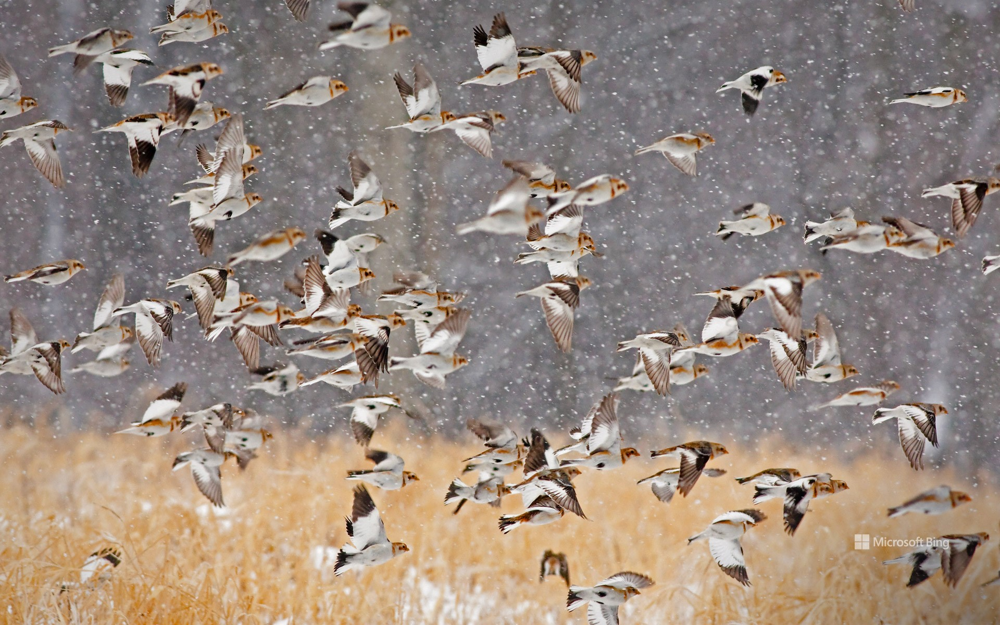

# D-G

## decent

[ˈdiːsnt]

adj.
像样的; 得体的; 正派的

- Assuming that you have a decent understanding of C#, getting started 
in WPF isn't too difficult.
- I need a decent night's sleep.
\
我需要好好地睡上一夜。

## detour

[ˈdiːtʊr]

v.
绕路，绕道

n.
绕道; 弯路

A PennDOT spokesperson says it's because of an embankment slide, 
but that means that people who use that road everyday will 
have to take a 20-mile detour.

## dial it down or ramp it down

<https://english.stackexchange.com/questions/502556/dial-it-down-or-ramp-it-down>

What is the meaning of the last sentence? How do you relate it with previous 
sentences? I should explain in advance that the writer is addressing a speaker 
who is giving his or her lecture in front of the audience on the stage.

> A good rule of thumb is to keep your facial expression consistent with your 
> ideas. You can have big ideas - they're only listening to you, after all. 
> You may feel the need to keep your face neutral, which is boring, in a conversation 
> about your ideas, but don't forget, you're the only one up there. Represent your 
> ideas. If they're big, be big. It's easier to dial it down than ramp it up.

In the context of advice about whether to show animation while giving a speech, the sentence

> - It's easier to dial it down than ramp it up.

means that moving from extreme animation to less animation is easier to do than becoming 
more animated after showing little animation at first. The meaning is conveyed by metaphor.

*Dial down* and *ramp up* are phrasal verbs, which take pronoun objects between the verb and 
its particle. The object -- *it* -- refers to the same thing in each case -- animation while 
speaking -- and the opposition of up and down as particles for the phrasal verb shows that 
they are opposites.

They are also both metaphors, and not the same metaphor, which makes it confusing.

*Dial* refers to a volume knob on an old radio or stereo (supplanted by icons to press on 
newer equipment). Turning the knob, or dial, raised or lowered the sound volume. Dialing it 
up raises the volume (this is an UP/DOWN metaphor), and dialing it down lowers it.

A *ramp*, on the other hand, is a tilted surface for movement vertically. To *ramp up* 
something is to increase its height, which may simply mean providing a larger number, as here.

Consequently both *turn up* and *ramp up* have much the same meaning in this context, as do 
*turn down* and *ramp down*. So why use two? Good question.

Probably for variety. This is a motto that the listener is supposed to bear in mind, after 
all, and the punchier it is, the more likely they are to remember it. Or so one can hope.

## dish

It's not even the same dish! 甚至完全就不是同一道菜

## distinctly

[dɪˈstɪŋktli]

adv.
明显地; 无疑地; 确实地; 逼真

I remember it distinctly. 我记得非常清楚

## ditch

[dɪtʃ]

n.
沟，渠\
v.
抛弃; 甩掉; （使）紧急迫降

She ditched me and she's leaving me to finish off the vlog without her.\
Did you ditch class today? 你今天逃课了？\
He ditched his girlfriend.\
That doesn't give you the right to ditch me! 那不是放我鸽子的好理由

[老友记片段](https://www.ixigua.com/7038462895612494367)

## doughy

[ˈdoi]

劲道

The noodles are a lot more doughy 面条更劲道些

## down the drain

化为乌有、落空、付之东流、前功尽弃、泡汤了、白费了、打了水漂

All that work ... down the drain. 所有的努力都付之东流
The case is going down the drain. 该案将前功尽弃了

## drunk with power

沉溺于权力

I'm totally drunk with power. 我被权力冲昏了头

## emulsion

[ɪˈmʌlʃən]

n.
乳状液; 感光乳剂; [药]乳剂; 乳胶漆

## endangered

[ɪnˈdeɪndʒərd]

adj.
（动物、鸟类等）濒危的，濒于灭绝的

endangered animal

## extinct

[ɪkˈstɪŋkt]

adj.
灭绝的; 废除了的; （火山）死的

an extinct species

## fair and square

[fɛr ənd skwɛr]

光明正大; 公正地; 正中目标; 公平合理

You won fair and square. 你赢得光明正大。

[老友记片段](https://www.ixigua.com/7025544939777819166)

## fall out

[fɔːl aʊt]

争吵; 结果; 解散; 掉队

That's because we had a bit of a falling out. 因为我们之前闹翻了

[老友记片段](https://www.ixigua.com/7024658888171782669)

## fashion

[ˈfæʃn]

n.
时尚（界）; 时装; 以…方式
v.
制作，塑造

We're fashioning a very long poking device.

[老友记片段](https://www.ixigua.com/7009618240964035086)

## felony

[ˈfɛləni]

n.
<法>重罪

To become a school bus driver, you must have a clean driving record, 
and cannot have any felonies.

## feral

[ˈfɪrəl, ˈfɛr-]

adj.
（动物）野生的，未驯的，野蛮的

feral cats 野猫

## ferocious

[fəˈroʊʃəs]

adj.
残忍的; 极度的; 凶猛; 恶

ferocious lion

## fill silence

尬聊；没话找话

- You don't need to fill these silence. 你不必没话找话
- Okay, thanks.

**泛读材料：**
- [Why do we need to fill the silence? Can we do anything about it?](https://www.linkedin.com/pulse/why-do-we-need-fill-silence-can-anything-andrew-sharp)
- [How to Fill Awkward Silences](https://www.wikihow.com/Fill-Awkward-Silences)

## finger licking

吮指

## flip a coin

Girls. Girls. Stop. Okay, we'll flip a coin. 女士们，停一停。我们投硬币确定吧。\
Heads, she's Rachel's. 正面，归瑞秋。\
Tails, she's Monica's. 反面，归莫妮卡。

[老友记片段](https://www.ixigua.com/7025544939777819166)

## flock

[flɑːk]

n.
兽群，鸟群; 一大群人; 教徒; 软棉填料

Snow buntings flock during a snow storm in New York

## fool around

[fuːl əˈraʊnd]

闲耍; 虚度光阴; （和某人）乱搞（男女关系）; 鬼混

- Would you ever fool around.
你还会四处游荡吗?
- I fooled around with Joey's sister. 我睡了乔伊的妹妹

[老友记片段](https://www.ixigua.com/7039209797006459405)

## forklift

['fɔkˌlɪft]

n.
<美>铲车; 叉车

## fowl

[faʊl]

n.
鸡; 家禽

Carve the fowl into 8 pieces.

## funny business

恶作剧

## G-rated

['dʒi:'reitid]

adj.
[电影]G级的；老幼皆宜的

## get back at

[ɡɛt bæk æt]

报复

I'm just doing it to get back at Ross. 我仅仅想报复罗斯。

[老友记片段](https://www.ixigua.com/7022561478431474189)

## get to the bottom of

[ɡɛt tu ði ˈbɑtəm ʌv]

弄清…底细; 根究

The city wants to get to the bottom of why the fix was doing more harm than good.

## ghost town

[ɡoʊst taʊn]

n.
城市的废墟

Two days later, Penny moved in, and so much blood rushed to your genitals, 
your brain became a ghost town. 于是你的脑子就废了
[大爆炸片段](https://www.ixigua.com/7009152166753796621)

## give away the farm

verb. To pay more than one should have; to pay over fair market value.

Oh no, don't give away the farm! 别, 料都爆完了!\
And try not to be total pussies and give away the whole farm. 别太懵逼了以至倾家荡产一无所有

[老友记片段](https://www.ixigua.com/7029904919331570206)

## go-kart / go-cart

卡丁车

## godspeed

(对启程的人的祝愿语)成功；一路顺风

- Not farewell or Godspeed, but "Go slowly." 不说再见,不说祝你平安, 而说 “ 慢走 ”.

## graham

['greɪəm]

Graham flour is a form of whole wheat flour. It is named after it's inventor Sylvester 
Graham, a forerunner of the health food movement. Graham developed this form of flour in 
the 1830s in hopes of diverting people away from the less healthy refined white flour.

adj.
全麦（面粉）的，粗面粉的

## greasy

[ˈɡriːsi]

adj.
油腻的; 谄媚的; 含脂肪多的

Beijing food is rich but not greasy. 京菜油重但不油腻

It's a little dry 有点干
but actually it's not overly greasy and 其实也不是太油腻
the taste is actually really good 味道还挺不错的

## gross

[ɡroʊs]

adj.
总的，毛的; 严重的; 令人不快的; 粗鲁的 \
n.
总收入; 罗（一罗为144个）\
vt.
总共收入为; 总共赚得 \
adv.
总共; 全部

Joey, that is so gross! 那也太无耻了

[老友记片段](https://www.ixigua.com/7019254506147807774)

## grumpy

[ˈɡrʌmpi]

adj.
凶巴巴的；脾气坏的; 性情粗暴的; 脾气暴躁的; 性情乖戾的

Ooh, grumpy you are. 好凶巴巴哦。

[大爆炸片段](https://www.ixigua.com/7029951820483002887)

## gullible

[ˈɡʌləbəl]

adj.
易受骗的，轻信的

Lenard, what did we say about being a gullible weenie?

[生活大爆炸片段](https://www.ixigua.com/7003595609609339406)

