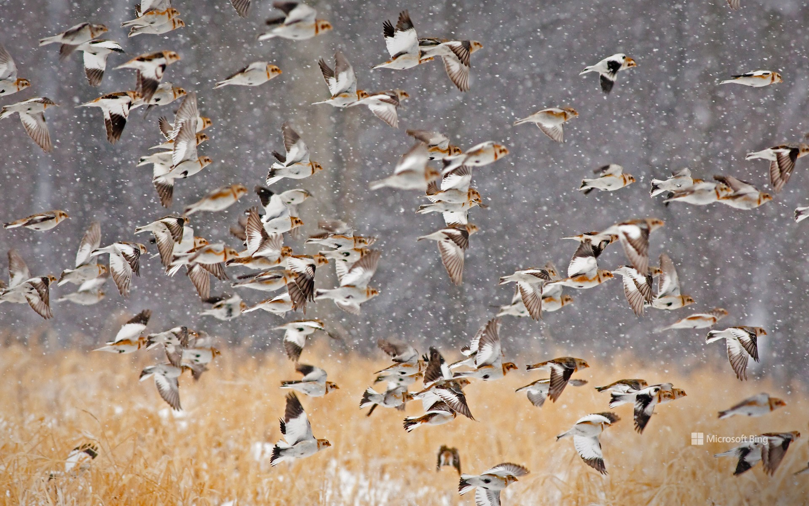

# F-G

## fair and square

[fɛr ənd skwɛr]

光明正大; 公正地; 正中目标; 公平合理

- You won fair and square. 你赢得光明正大。
- Our apartment! We won it fair and square. Twice! 我们的公寓。我们光明正大地赢了两次得到的！

参见：
- [老友记片段 1](https://www.ixigua.com/7025544939777819166)
- [老友记片段 2](https://www.ixigua.com/7055865853706764831)

## fall out

[fɔːl aʊt]

争吵; 结果; 解散; 掉队

That's because we had a bit of a falling out. 因为我们之前闹翻了

[老友记片段](https://www.ixigua.com/7024658888171782669)

## fashion

[ˈfæʃn]

n.
时尚（界）; 时装; 以…方式
v.
制作，塑造

We're fashioning a very long poking device.

[老友记片段](https://www.ixigua.com/7009618240964035086)

## felony

[ˈfɛləni]

n.
<法>重罪

To become a school bus driver, you must have a clean driving record, 
and cannot have any felonies.

## feral

[ˈfɪrəl, ˈfɛr-]

adj.
（动物）野生的，未驯的，野蛮的

feral cats 野猫

## ferocious

[fəˈroʊʃəs]

adj.
残忍的; 极度的; 凶猛; 恶

ferocious lion

## fill silence

尬聊；没话找话

- You don't need to fill these silence. 你不必没话找话
- Okay, thanks.

**泛读材料：**
- [Why do we need to fill the silence? Can we do anything about it?](https://www.linkedin.com/pulse/why-do-we-need-fill-silence-can-anything-andrew-sharp)
- [How to Fill Awkward Silences](https://www.wikihow.com/Fill-Awkward-Silences)

## finger licking

吮指

## flight

*n.*
航班; 一层楼梯; 一群飞鸟

went up two flights of stairs 爬了两层楼梯

## flip a coin

Girls. Girls. Stop. Okay, we'll flip a coin. 女士们，停一停。我们投硬币确定吧。\
Heads, she's Rachel's. 正面，归瑞秋。\
Tails, she's Monica's. 反面，归莫妮卡。

[老友记片段](https://www.ixigua.com/7025544939777819166)

## flip out

精神失常，发疯

but then he started to flip out and now this feels like a bad idea

[大爆炸片段](https://www.ixigua.com/7053424288761643551)

## flock

[flɑːk]

n.
兽群，鸟群; 一大群人; 教徒; 软棉填料

Snow buntings flock during a snow storm in New York

## foodie

[ˈfudi]

*n.*
美食家; 爱吃的人; 吃货（=foody）

She's a foodie, right? 她是个吃货，对吧?

## fool around

[fuːl əˈraʊnd]

闲耍; 虚度光阴; （和某人）乱搞（男女关系）; 鬼混

- Would you ever fool around.
你还会四处游荡吗?
- I fooled around with Joey's sister. 我睡了乔伊的妹妹

[老友记片段](https://www.ixigua.com/7039209797006459405)

## foot cramp

脚抽筋

## forklift

['fɔkˌlɪft]

n.
<美>铲车; 叉车

## fowl

[faʊl]

n.
鸡; 家禽

Carve the fowl into 8 pieces.

## funny business

恶作剧

## G-rated

['dʒi:'reitid]

adj.
[电影]G级的；老幼皆宜的

## get back at

[ɡɛt bæk æt]

报复

I'm just doing it to get back at Ross. 我仅仅想报复罗斯。

[老友记片段](https://www.ixigua.com/7022561478431474189)

## get to the bottom of

[ɡɛt tu ði ˈbɑtəm ʌv]

弄清…底细; 根究

The city wants to get to the bottom of why the fix was doing more harm than good.

## ghost town

[ɡoʊst taʊn]

n.
城市的废墟

Two days later, Penny moved in, and so much blood rushed to your genitals, 
your brain became a ghost town. 于是你的脑子就废了
[大爆炸片段](https://www.ixigua.com/7009152166753796621)

## give away the farm

verb. To pay more than one should have; to pay over fair market value.

Oh no, don't give away the farm! 别, 料都爆完了!\
And try not to be total pussies and give away the whole farm. 别太懵逼了以至倾家荡产一无所有

[老友记片段](https://www.ixigua.com/7029904919331570206)

## go-kart / go-cart

卡丁车

## godspeed

(对启程的人的祝愿语)成功；一路顺风

- Not farewell or Godspeed, but "Go slowly." 不说再见,不说祝你平安, 而说 “ 慢走 ”.

## graham

['greɪəm]

Graham flour is a form of whole wheat flour. It is named after it's inventor Sylvester 
Graham, a forerunner of the health food movement. Graham developed this form of flour in 
the 1830s in hopes of diverting people away from the less healthy refined white flour.

adj.
全麦（面粉）的，粗面粉的

## greasy

[ˈɡriːsi]

adj.
油腻的; 谄媚的; 含脂肪多的

Beijing food is rich but not greasy. 京菜油重但不油腻

It's a little dry 有点干
but actually it's not overly greasy and 其实也不是太油腻
the taste is actually really good 味道还挺不错的

## greenhorn

[ˈgrinhɔrn]

*n.*
无经验易受骗的人，涉世不深的人; 不经事

As a wpf greenhorn i have a little question. 作为新手我有个小问题要问

**参见：** 
- [newbie](j-n.md#newbie)
- [noob](j-n.md#noob)

## groom

新郎

## gross

[ɡroʊs]

adj.
总的，毛的; 严重的; 令人不快的; 粗鲁的 \
n.
总收入; 罗（一罗为144个）\
vt.
总共收入为; 总共赚得 \
adv.
总共; 全部

Joey, that is so gross! 那也太无耻了

[老友记片段](https://www.ixigua.com/7019254506147807774)

## grumpy

[ˈɡrʌmpi]

adj.
凶巴巴的；脾气坏的; 性情粗暴的; 脾气暴躁的; 性情乖戾的

Ooh, grumpy you are. 好凶巴巴哦。

[大爆炸片段](https://www.ixigua.com/7029951820483002887)

## gullible

[ˈɡʌləbəl]

adj.
易受骗的，轻信的

Lenard, what did we say about being a gullible weenie?

[生活大爆炸片段](https://www.ixigua.com/7003595609609339406)

