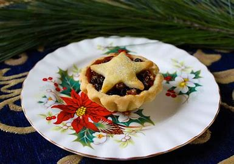

# H-N

## hail

[heɪl]

n.
冰雹; 一阵

vi.
下冰雹; 如冰雹般地降下

## hare

[her]

n.
野兔; 怪人，傻瓜
vt.& vi.
飞跑，疾走

## head

/hed/

verb. to go in a particular direction

* Okay, we're headed out -- See you later.
* I was heading out of the room when she called me back.
* We were heading towards Kumasi when our truck broke down.
* He headed straight for (= went towards) the fridge.
* I think we ought to head back/home (= return to where we started) now, before it gets too dark.

## hint

[hɪnt]

n.
线索，迹象; 提示，注意事项; 暗示; 微量
vt.
暗示
vi.
暗示，提示

You know there is a hint of Xinjiang here. 这里有一点新疆的味道 \
a hint of a smile 一丝笑意 \
There's a subtle hint of garlic in the sauce. 调味汁里稍微有一点蒜味

## hit me again

1. In blackjack, a request for the dealer to give one another card. \
I was still pretty far from 21, so I said, "Hit me again!"

2. slang A request for another alcoholic drink. \
Yeah, I'll take another shot — hit me again!

[大爆炸片段](https://www.ixigua.com/7005514780731507236)

## hop

[hɑːp]

vi.
跳上[下]; 单足蹦跳; 齐足（或双足）跳行; 摘葎草花\
vt.
跃过; 登上（飞机、汽车、火车等）; 在…跳来跳去; 加啤酒花于\
n.
跳舞; 蹦跳; （棒球等的）弹跳; （非正式）舞会\
vt.& vi.
换来换去，不断更换

Oh, I, uh, I hopped a fence, 我...我翻过了围栏,\
and they caught me in the sculpture gallery 结果他们在雕像馆抓到了我时\
making out with a Chewbacca statue. 我正在和一个 Chewbacca 雕像亲热

[大爆炸片段](https://www.ixigua.com/7029951820483002887)

## hop-on hop-off sightseeing tourist bus

随上随下观光巴士

## housekeeping

[ˈhaʊsˌkipɪŋ]

n.
家务，家政; （工商企业等的）总务; 家务管理; 家用开支;
客房服务

[大爆炸片段](https://www.ixigua.com/7010030799319892493)

## hub

[hʌb]

n.
轮轴; 中心，焦点; （电器面板上的）电线插孔; [计]集线器

- contruction hub: 制造中心

Areas of dense construction are defined as "Construction Hubs" and are actively 
managed to ensure mobility and access to and through work zones.

**China** is the manufacturing hub of the world also referred by “The Factory Of The World”. 
If any large company wants to manufacture its goods, China has always been its first 
preference. The majority of the tags and labels we see on goods are of “Made in China”. We 
all are aware of the above things but did we ever wanted to know Why China?

## humiliating

[hju'mɪlɪeɪtɪŋ]

adj.
丢脸的

It would be humiliating. 那会好丢脸

[大爆炸片段](https://www.ixigua.com/7022291308823708174)

## inevitable

[ɪnˈevɪtəbl]

adj.
不可避免的; 必然发生的; 必然(发生)的

Amy, mourning the inevitable is a complete waste of time.

[大爆炸片段](https://www.ixigua.com/7004691104222151198)

## internal clock

[ɪnˈtɚnəl klɑk]

n.
生物钟；内部时钟

Input to the inverting oscillator amplifier and input to the internal clock operating circuit.

## intestines

[ɪn'testɪnz]

n.
肠( intestine的名词复数 )

You said you could smell pig intestines. 你说你可以闻到猪大肠的味道

## involution

[ˌɪnvə'luʃən]

n.
内卷; 卷绕，回旋; 复归; 包卷; 对合

## irritated

[ ˈɪrɪteɪtɪd]

adj.
恼怒的，生气的

Well, I'll give you three guesses 给你们三次机会猜猜\
why I'm so irritated. 为啥我很生气

## it'll get better

I know, it's LaPooh right now but it'll get better.
现在你为狗狗拉普难过, 等下这就算不得什么了。

[老友记片段](https://www.ixigua.com/7010353282124087838)

## janitor

[ˈdʒænɪtɚ]

n.
看门人; 看管房屋的人，通常也是清洁工; 门房

Then I choose a janitor. 'Cause I'm about to throw up.

[大爆炸片段](https://www.ixigua.com/7024854238245159438)

## lamppost

[ˈlæmpˌpost]

n.
灯杆，路灯柱

## latex

[ˈleˌtɛks]

n.
胶乳，（尤指橡胶树的）橡浆; 人工合成胶乳（用以制作油漆、粘合剂和织物）

Leonard, what if you have an allergic reaction to the surgeon's latex gloves?
要是你对外科医生使用的乳胶手套产生过敏反应该怎么办？

[大爆炸片段](https://www.ixigua.com/7014861783793926687)

## league

[liːɡ]

n.
1. An association of states, organizations, or individuals for common action; an alliance.
2. Sports An association of teams or clubs that compete chiefly among themselves. Also called loop1.
3. A class or level of competition: The ski jump was out of his league.

Well, I think Brian's a little out of your league. 咱觉得布莱恩比你的水准得高点\
They're in a different league from us.他们与我们不属同一个级别\
When it comes to cooking, I'm not in her league (= she is much better than me). 提到烹饪，我的水平远比不上她。

[大爆炸片段](https://www.ixigua.com/7022952819149767204)

## leaps and bounds

跳跃; 突飞猛进；一日千里

- They know that China is in leaps and bounds
- Her French is improving by leaps and bounds.

## limb

[lɪm]

out on a limb: 
in or into a dangerous or uncompromising position, 
where one is not joined or supported by anyone else; 
vulnerable.

All the other countries signed the agreement, leaving Britain out on a limb.

Hey, come on, give me a break. I'm out on a limb here.

[老友记片段](https://www.ixigua.com/7006282798499627550)

## literacy

[ˈlɪtərəsi]

* financial literacy
* scientific literacy —— 科学素养

## lunatic

[ˈluːnətɪk]

n.
精神失常者，精神病人; 疯子; 极愚蠢的人; 狂人
adj.
疯狂的; 精神错乱的; 愚蠢的; 极端的

## make out with

NORTH AMERICAN\
informal\
kiss and caress amorously.\

"Ernie was making out with Bernice"

## malarkey

[məˈlɑrki]

n.
废话; 蠢行

This is malarkey! 这是屁话

[大爆炸片段](https://www.ixigua.com/7004070526461149703)

## mince pie

[mɪns]

vt.
切碎，剁碎; 委婉的说
vi.
碎步走; 装腔作势地说
n.
绞碎的肉，肉末

 \
mincemeat pie

## noise cancelling headphones

## not even

not even

Not even Amy knows! 甚至连艾米都不知道

[大爆炸片段](https://www.ixigua.com/7025555480508367368)

