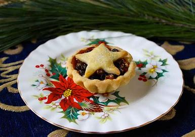

# J-N

## janitor

[ˈdʒænɪtɚ]

n.
看门人; 看管房屋的人，通常也是清洁工; 门房

Then I choose a janitor. 'Cause I'm about to throw up.

[大爆炸片段](https://www.ixigua.com/7024854238245159438)

## jaywalk

*v.*
乱穿马路

## jeepers creepers

我的个天

Please refer to:
- [大爆炸片段](https://www.ixigua.com/7056301385033187847)
- [minced oaths](#minced-oaths)

## jolly

[ˈdʒɑːli]

*adj.*
快活的; 兴高采烈的; 愉快的; 有趣的

- For she's a jolly good fellow 因为她是个快乐的好人 \
For he's a jolly good fellowwwwwww \
which nobody can deny 没人能否认

## kangaroo

[ˌkæŋɡəˈruː]

袋鼠

## kick

*informal* *n.* \
the sharp stimulant effect of something, especially alcohol:
- strong stuff, this brew: he felt the kick

a thrill of pleasurable, often reckless excitement：
- rich kids turning to crime just for kicks
- I get such a kick out of driving a race car

a specified temporary interest or enthusiasm:
- I went on a bit of a license kick. 我有段时间迷上了考照
- the jogging kick

## kick scooter - push-scooter

A kick scooter is a human-powered street vehicle with a handlebar, 
deck, and wheels propelled by a rider pushing off the ground with 
their leg. 

## kiosk

[ˈkiːɑːsk]

n.
亭子，凉亭; （车站、广场等处的）书报摊，，公共电话亭; 小摊棚，售货亭

## knob

[nɑːb]

*n.*
球形把手; （收音机等的）旋钮; 小块; 疙瘩

## kook

[kuk]

n.
<美口>怪人; 疯子; 怪癖的; 疯狂的

- Okay, so I'm responsible, I'm organized. But I can be a kook. \
  好吧，所以我有责任心，我有条理，但也可以是一个怪人。

## kudos

[ˈkudɑs]

点赞，赞一个

## lamppost

[ˈlæmpˌpost]

n.
灯杆，路灯柱

## lasagna / lasagne

[ləˈzɑnjə]

Lasagne are a type of pasta, possibly one of the oldest types, made of very wide, flat sheets. Either term can also refer to an Italian dish made of stacked layers of lasagne alternating with fillings such as ragù, vegetables, cheeses, and seasonings and spices, like Italian seasoning, such as garlic, oregano and basil. The dish may be topped with grated cheese, which becomes melted after baking. Typically cooked pasta is assembled with the other ingredients and then baked in an oven. The resulting casserole is cut into single-serving square portions.

[World's Best Lasagna](https://www.allrecipes.com/recipe/23600/worlds-best-lasagna/)

## latex

[ˈleˌtɛks]

n.
胶乳，（尤指橡胶树的）橡浆; 人工合成胶乳（用以制作油漆、粘合剂和织物）

Leonard, what if you have an allergic reaction to the surgeon's latex gloves?
要是你对外科医生使用的乳胶手套产生过敏反应该怎么办？

[大爆炸片段](https://www.ixigua.com/7014861783793926687)

## league

[liːɡ]

n.
1. An association of states, organizations, or individuals for common action; an alliance.
2. Sports An association of teams or clubs that compete chiefly among themselves. Also called loop1.
3. A class or level of competition: The ski jump was out of his league.

Well, I think Brian's a little out of your league. 咱觉得布莱恩比你的水准得高点\
They're in a different league from us.他们与我们不属同一个级别\
When it comes to cooking, I'm not in her league (= she is much better than me). 提到烹饪，我的水平远比不上她。

[大爆炸片段](https://www.ixigua.com/7022952819149767204)

## leaps and bounds

跳跃; 突飞猛进；一日千里

- They know that China is in leaps and bounds
- Her French is improving by leaps and bounds.

## leftover

残羹剩菜

## lightning round

The lightning round! 
抢答环节

[老友记片段](https://www.ixigua.com/7054528337271915015)

## limb

[lɪm]

out on a limb: 
in or into a dangerous or uncompromising position, 
where one is not joined or supported by anyone else; 
vulnerable.

All the other countries signed the agreement, leaving Britain out on a limb.

Hey, come on, give me a break. I'm out on a limb here.

[老友记片段](https://www.ixigua.com/7006282798499627550)

## lingerie

[ˌlɑndʒəˈreɪ]

*n.*
女用贴身内衣裤

## literacy

[ˈlɪtərəsi]

* financial literacy
* scientific literacy —— 科学素养

## lousy

差劲

- I'm lousy at goodbyes. 我不善于辞别
- I am lousy at packing, right? 打包收拾我很差劲

## lunatic

[ˈluːnətɪk]

*n.*
精神失常者，精神病人; 疯子; 极愚蠢的人; 狂人 \
*adj.*
疯狂的; 精神错乱的; 愚蠢的; 极端的

## lymphatic

[lɪm'fætɪk]

*adj.*
淋巴的; 分泌淋巴的; 输送淋巴的; （指人）苍白无力的

## make out with

NORTH AMERICAN\
informal\
kiss and caress amorously.\

"Ernie was making out with Bernice"

## malarkey

[məˈlɑrki]

n.
废话; 蠢行

This is malarkey! 这是屁话

[大爆炸片段](https://www.ixigua.com/7004070526461149703)

## maniac

[ ˈmeɪniæk]

*n.*
疯子; 癖好者; 狂人; 躁狂者 \
*adj.*
发狂的; 狂热的; 疯狂的

What kind of maniacs have coitus in someone else's bedroom?! 
什么样的疯子会在别人的房间里交媾

[大爆炸片段](https://www.ixigua.com/7053789245713941023)

## mascot

吉祥物

## matchmaker

媒婆，红娘

## matrimony

[ˈmætrɪmoʊni]

*n.*
结婚，婚礼；婚姻生活

- We are gathered here today 今天我们齐聚在此 \
to join this man 参加这个男人 \
and this woman in the bonds of holy matrimony. 跟这个女人的神圣婚礼。

## meddle

*v.*
干涉，插手; 弄，摸弄，用手玩弄; 参与，发生关系

- You meddled in our relationship! 你插手了我们的关系

## mediocre

[ˌmiːdiˈoʊkər]

*adj.*
普通的; 平庸的；中等的; 质量中等偏下的

- Mediocre oyster bar 多么普通的生蚝店\
it's very mediocre 太平庸了 \
But we paid $100 dollars 但我们付了100美元

## menage a trois

[ˌmeɪnɑ:ʒ ɑ: ˈtrwʌ]

n.
<法>（一妻一妾）三角家庭 \
household for three; an arrangement where a married couple and a lover 
of one of them live together while sharing sexual relations

## mince pie

[mɪns]

vt.
切碎，剁碎; 委婉的说
vi.
碎步走; 装腔作势地说
n.
绞碎的肉，肉末

 \
mincemeat pie

## minced oaths

heck instead of hell,  shoot for shit, golly and gosh for God, jeepers creepers for Jesus Christ

- [def jeepers creepers](https://www.dictionary.com/e/slang/jeepers-creepers/)
- [jeepers creepers](#jeepers-creepers)

## miscellaneous

[ˌmɪsəˈleɪniəs]

*adj.*
各种各样的; 五花八门的; 混杂的; 多方面的

- a sale of miscellaneous household items 各种生活用品大减价

## mommy-to-be

准妈咪

## moonlight

[ˈmunˌlaɪt]

*vi.*
兼职

- I moonlight as a travel guide.
\
我以导游做兼职工作.

## mopey

['mɒpɪ]

*adj.*
无精打采的，闷闷不乐的，消沉的

- Are you gonna be this mopey all the way home?\
回家路上你要一直也这么丧吗？

## nag

[næɡ]

*v.*
唠叨; 不断困扰，使不得安宁\
*n.*
马

- She nags her husband all day long

## newbie

[ˈnubi]

*n.*
网络新手，新兵

**参见：** 
- [greenhorn](d-g.md#greenhorn)
- [noob](#noob)

## noise cancelling headphones

## noob

[nub]

菜鸟

Please note the procedural switch-case (noob) implementation is the simplest, 
violates the OCP principle is used only to explain the theory. 

**参见：** 
- [greenhorn](d-g.md#greenhorn)
- [newbie](#newbie)

## not even

not even

Not even Amy knows! 甚至连艾米都不知道

[大爆炸片段](https://www.ixigua.com/7025555480508367368)

