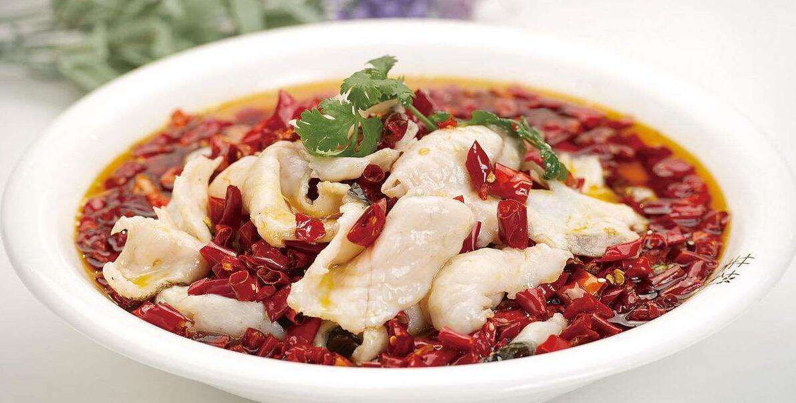

# Chinese Cuisine Seasoning

中餐调味品

Hubei Cuisine 楚菜

## 1 Chinese Five Spice Powder Recipe

**五香粉配方**

八角茴香、丁香、小茴香籽、桂皮和四川花椒。

[THE MEASUREMENTS TO CONVERT COMMON WHOLE SPICES INTO GROUND](https://www.mccormick.com/articles/lifehacker/the-measurements-to-convert-common-whole-spices-in)

[CHINESE FIVE SPICE](https://www.feastingathome.com/chinese-five-spice)

[CHINESE FIVE-SPICE POWDER](https://www.food.com/recipe/chinese-five-spice-powder-24232)

### 

- cilantro [sɪˈlæntroʊ] 香菜
- dipping sauce 蘸料
- green onions 葱
- oyster sauce 耗油
- vinegar [ˈvɪnɪɡər] 醋

- stir it all up 拌一下

## sizzling fish 沸腾鱼

