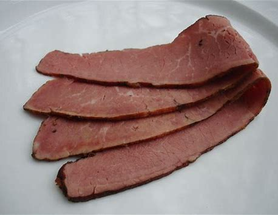
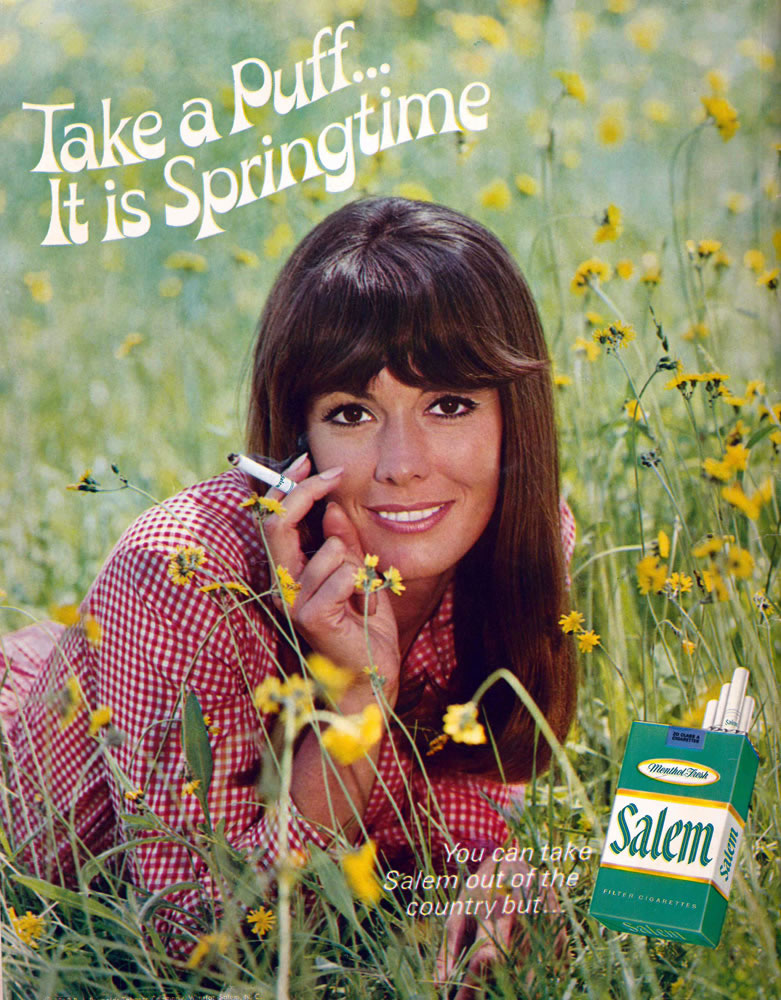
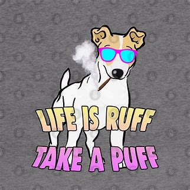
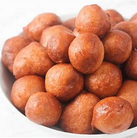

# O-R

## obscene

[əbˈsiːn]

adj.
淫秽的; 下流的; 猥亵的; 大得惊人的

obscene photographs

He earns an obscene amount of money. 他捞了一大笔钱。

## obsessed

[əb'sest]

*adj.*
着迷的; 一门心思的; （思想）无法摆脱的

I'm kind of obsessed with this place. 我有点爱上这个地方了。

## off-the-rack

['ɔfðər'æk]

(of clothes) ready-made rather than made to order.

Do you even understand what "off-the-rack" means? 你到底知不知道“现成的”是啥意思?

## ottoman

[ˈɑtəmən]

*n.*
脚凳；
（无靠背、无扶手的）长软椅; （装有厚垫靠背的）褥榻; 软垫搁脚凳; [纺织业]粗横棱纹织物

## out of your hair

俚语

不打扰你了，不麻烦你了

- You know what, just give me a second. I'll be out of your hair.
给我点时间，马上闪人。
- I'll get out of your hair. 就不打扰你们了。

[老友记片段](https://www.ixigua.com/7059729127900709407)

## overbite

龅牙

## pants

## pastrami

[pəˈstrɑmi]

Pastrami is a Romanian dish usually made from beef brisket, and sometimes from lamb, or turkey. The raw meat is brined, partially dried, seasoned with herbs and spices, then smoked and steamed. Like corned beef, pastrami was originally created as a way to preserve meat before the invention of refrigeration. One of the iconic meats of American Jewish cuisine and New York City cuisine, hot pastrami is typically served at delicatessens on sandwiches such as the pastrami on rye.

## easy-peasy

小菜一碟 \
Extremely easy or simple; requiring very little skill or effort.

- After so many years as an accountant, doing taxes is easy peasy for me.
- Don't worry, after some lessons and a bit of practice, driving will be 
easy peasy!

## pee-pee

小鸡鸡（儿童语）、尿尿

## peep

[piːp]

v.
窥视，偷看; （小鸟等）唧唧地叫; （从隐蔽处）出现\
n.
窥视; 唧唧声; 隐现; 慢慢露出

I'm gonna do this my way 我要按我的方式去做
and I don't wanna hear a peep out of you. 你不准唧唧歪歪

[老友记片段](https://www.ixigua.com/7026273808315056676)

## perky

[ˈpɜrki]

*adj.*
得意扬扬的; 神气的; 活泼的; 有生气的

No, they said I was too perky. 没有，他们说我太活泼了。

## perpendicular

[ˌpɜrpənˈdɪkjələ(r)]

adj.
垂直的，成直角的; 直立的，险陡的; [建]垂直式的; 〈谑〉直站着的

n.
垂直线，垂直面; 直立，直立姿势，廉直; 垂直测器，锤规; [建]垂直式建筑，绝壁

## pertinent

[ˈpɜːrtnənt]

*adj.*
有关的，相干的; 恰当的，中肯的; 关于…的; 切题的

a pertinent question/fact 有关的问题 / 事实

Each name specified within the XAML page starting at the page root is added to a 
pertinent XAML namescope.

## perm （permanent）

[pɜrm]

*n.*
电烫发 \
*vt.*
烫发

## pervert

[pərˈvɜːrt , ˈpɜːrvɜːrt]

v.
败坏，使走样，误导，误用; 腐蚀，侵害，使堕落\
n.
性变态者\
a person whose sexual behavior is regarded as abnormal and unacceptable.

Let's give our friend Joey a chance
to explain why he's such a big pervert!

[老友记片段](https://www.ixigua.com/7028434805066826270)

## phobia

[ˈfoʊbiə]

n.
恐惧; 厌恶

## phone case

手机壳套

## 'Phone it in' vs. 'Dial it in'

体育比赛相关用词

二者是一对反义词：前者意指敷衍了事, 后者指慢热并调整到最佳状态（例如发动机）

<https://www.merriam-webster.com/words-at-play/phone-it-in-vs-dialed-in>

## pill caddie

I still don't understand why you bought that pill caddie. 我还是不明白你为啥会买那个药盒

[大爆炸片段](https://www.ixigua.com/7041107165242720798)

## pill organizer

Pill Organizer, Tablet Storage Caddy, Drug Suitcases Dispensers with 6 compartments 
Hold Cod Liver Oil/Tablets/ Capsule, Nude (Pink White&Blue),Random

## pillar

[ˈpɪlər]

n.
柱，台柱，顶梁柱; 墩，柱脚; （组织、制度、信仰等的）核心

- Now, the kelp industry here in Xiapu has become a pillar industry. 支柱产业
- You know that the two pillars of marriage are openness and honesty.

## pivot

[ˈpɪvət]

n.
枢轴; 中心点，中枢; [物]支点，支枢; [体]回转运动

vi.
在枢轴上转动; 随…转移

vt.
把…放在枢轴上; 以…为核心; 使绕枢轴旋转; 由…而定

[老友记片段](https://www.ixigua.com/7007372303625355790)

## place

*n.*
名次; （数学）位\
*v.*
排名次

- He has risen to second place in the opinion polls.\
他在民意测验中已升至第二位。
- Did you win for miss South Dakota?
- No, I didn't even place.\
没有，我连名次都没有。

## ply

[plaɪ]

vt.& vi.
使用（工具）; 经常供应（食物、饮料）; 固定往来; 经营生意

n.
（毛线、绳等的）股; 层; 厚; （夹板的）层片

vt.
（娴熟地）使用

a sweater in four-ply yarn 四股毛线织成的毛衣

four-ply toilet paper 四层的厕纸

## point-blank

1. If you say something point-blank, you say it very directly and firmly, 
without explaining or apologizing. 
- The army apparently refused point-blank to do what was required of them. 
- Mr Patterson was asked point blank if he would resign. 

**Note:** Point-blank is also an adjective. 
- We received a point-blank refusal.

2. If someone or something is shot point-blank, they are shot when the gun 
is touching them or extremely close to them. 
- He fired point-blank at Bernadette. 

**Note:** Point-blank is also an adjective. 
- He had been shot at point-blank range in the back of the head.

## Point Blank Period

不接受反驳

1. Phrase meaning the end of a conversation, usually inserted to the end of 
a sentence when the speaker is tired of the subject.

2. Phrase attached to the end of a sentence in order to express a strong point.

## pomelo

[ˈpɑːməloʊ] [pəˈmeloʊ]

n.
柚子

## ponytail

马尾发

## portal

[ˈpɔrtl]

n.
入口; 桥门; [解剖学]肝门; 出孔

- The portal will get me right to the battlefield!

## preamble

[ˈpriˌæmbəl, priˈæm-]

*n.*
序; 绪言; （法令、文件等的）序文; 前言

- 'I would like you to return to the villa as soon as possible,' she said without preamble.
\
她开门见山地说：“我想让你尽快回到别墅。”
- I know I need to define these two new environments in the preamble, but don't know how. 

## prenup

['prinʌp]

n.
<美><口>婚前协议

## presumption

[prɪˈzʌmpʃn]

n.
推测，设想; 放肆，傲慢; <律>推定

- I'll tell you exactly what you should do: 我来告诉你该怎样去做：\
avoid the presumption of the Terran sensory input paradigm 避免对地球人感知模式先入为主的偏见

## Pringles

*n.*
“品客”薯片; [地名] [阿根廷] 普林格莱斯

## prone

[proʊn]

*adj.*
易于…的; 俯卧的; 有…倾向的; 倾斜的，坡陡的

- but these are prone to errors if nested file importing is needed
- error-prone 容易出错的

## prowess

[ˈpraʊəs]

n.
非凡的能力；英勇; 高超技艺

academic/sporting/acting/physical prowess 学术体育运动造诣高、演技高超、体能优异

## puberty

[ˈpjuːbərti]

Puberty is the time in life when a boy or girl becomes sexually mature. It is a process 
that usually happens between ages 10 and 14 for girls and ages 12 and 16 for boys. It 
causes physical changes, and affects boys and girls differently. The first sign of 
puberty is usually breast development. Then hair grows in the pubic area and armpits.

## puff

[pʌf]

Alright, now try taking a puff. 好，现在试试吸一口（烟）。

## puffer fish

['pʌfər]

n.
河豚

## puke

[pjuk]

*v.*
呕吐

- It makes me want to puke. 我都快吐了

## pull off

成功，胜利完成; 脱去; 捣鬼

- The old oil guys 石油界的前辈认为 \
they figured there was no way we were
我们绝对不可能 \
going to be able to survive 生存下去\
that we could pull it off. 不认为我们能成功。

## pull (some/a few) strings

To use the power or influence one has over others, especially people of 
importance, to get what one wants or to help someone else.

- I hear that the only reason Johnny got into college was because his dad 
pulled some strings with the president of the university.
- I actually know a few people who work at the restaurant, so I'll see if I 
can pull a few strings and get you a table.
- You wait and see, he's going to start pulling strings to get this police 
investigation quashed.

## push sth back

拖延，推迟

- I guess I could push it back. 我猜我能延期一下
- Hey, uh, deployment meeting's gonna be pushed back an hour \
嘿 呃 部署会议推迟一小时

## put down

[ˈpʊt daʊn]

放下; 付定金; 镇压; **贬低，奚落的话**

Why do you constantly feel the need to put down my husband?

## putz

[pʌts]

n.
<美><非正>笨蛋，傻瓜； 阴茎

v.
闲荡；游手好闲

1. (Yiddish) a fool; an idiot
2. obscene terms for penis

- You are a putz

[大爆炸片段](https://www.ixigua.com/7004795980377915912)

## quarantine

[ˈkwɔːrəntiːn]

*n.*
检疫期，隔离期; 检疫所，隔离所; 四十天的时间\
*vt.*
对…进行检疫; 隔离

- She is at the hospital in quarantine. 她在医院被隔离

