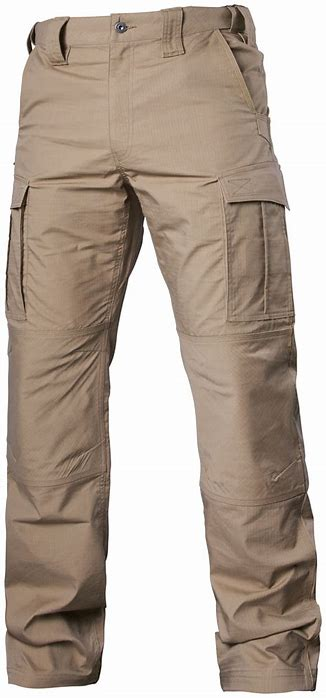
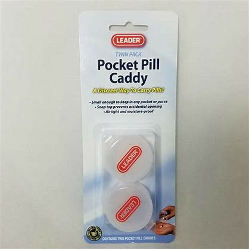
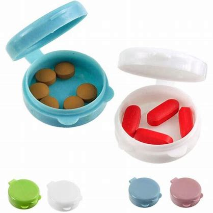
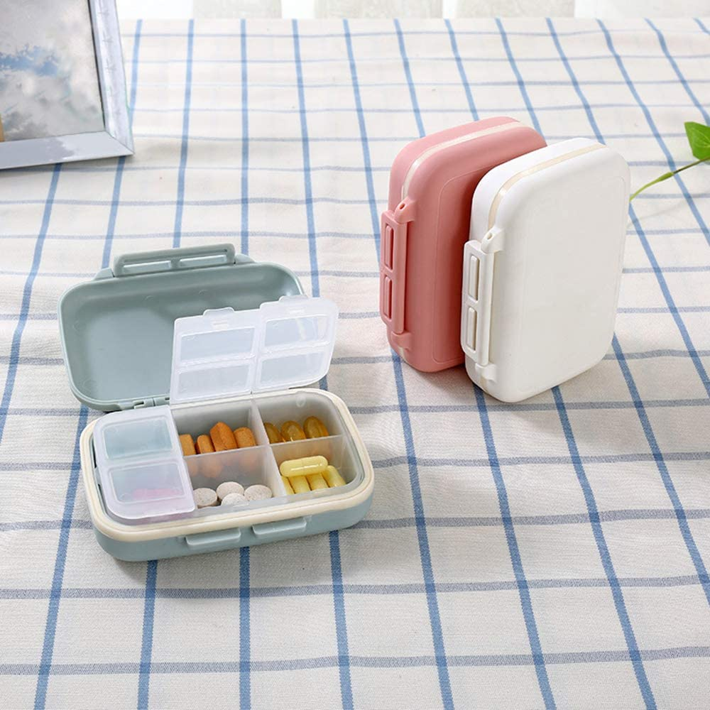

# O-R

## obscene

[əbˈsiːn]

adj.
淫秽的; 下流的; 猥亵的; 大得惊人的

obscene photographs

He earns an obscene amount of money. 他捞了一大笔钱。

## obsessed

[əb'sest]

*adj.*
着迷的; 一门心思的; （思想）无法摆脱的

I'm kind of obsessed with this place. 我有点爱上这个地方了。

## off-the-rack

['ɔfðər'æk]

(of clothes) ready-made rather than made to order.

Do you even understand what "off-the-rack" means? 你到底知不知道“现成的”是啥意思?

## out of your hair

俚语

不打扰你了，不麻烦你了

- You know what, just give me a second. I'll be out of your hair.
给我点时间，马上闪人。
- I'll get out of your hair. 就不打扰你们了。

[老友记片段](https://www.ixigua.com/7059729127900709407)

## pants

## peep

[piːp]

v.
窥视，偷看; （小鸟等）唧唧地叫; （从隐蔽处）出现\
n.
窥视; 唧唧声; 隐现; 慢慢露出

I'm gonna do this my way 我要按我的方式去做
and I don't wanna hear a peep out of you. 你不准唧唧歪歪

[老友记片段](https://www.ixigua.com/7026273808315056676)

## perpendicular

[ˌpɜrpənˈdɪkjələ(r)]

adj.
垂直的，成直角的; 直立的，险陡的; [建]垂直式的; 〈谑〉直站着的

n.
垂直线，垂直面; 直立，直立姿势，廉直; 垂直测器，锤规; [建]垂直式建筑，绝壁

## pertinent

[ˈpɜːrtnənt]

*adj.*
有关的，相干的; 恰当的，中肯的; 关于…的; 切题的

a pertinent question/fact 有关的问题 / 事实

Each name specified within the XAML page starting at the page root is added to a 
pertinent XAML namescope.

## pervert

[pərˈvɜːrt , ˈpɜːrvɜːrt]

v.
败坏，使走样，误导，误用; 腐蚀，侵害，使堕落\
n.
性变态者\
a person whose sexual behavior is regarded as abnormal and unacceptable.

Let's give our friend Joey a chance
to explain why he's such a big pervert!

[老友记片段](https://www.ixigua.com/7028434805066826270)

## phobia

[ˈfoʊbiə]

n.
恐惧; 厌恶

## phone case

手机壳套

## 'Phone it in' vs. 'Dial it in'

体育比赛相关用词

二者是一对反义词：前者意指敷衍了事, 后者指慢热并调整到最佳状态（例如发动机）

<https://www.merriam-webster.com/words-at-play/phone-it-in-vs-dialed-in>

## pill caddie

I still don't understand why you bought that pill caddie. 我还是不明白你为啥会买那个药盒

[大爆炸片段](https://www.ixigua.com/7041107165242720798)

## pill organizer

Pill Organizer, Tablet Storage Caddy, Drug Suitcases Dispensers with 6 compartments 
Hold Cod Liver Oil/Tablets/ Capsule, Nude (Pink White&Blue),Random

## pillar

[ˈpɪlər]

n.
柱，台柱，顶梁柱; 墩，柱脚; （组织、制度、信仰等的）核心

Now, the kelp industry here in Xiapu has become a pillar industry. 支柱产业

## pivot

[ˈpɪvət]

n.
枢轴; 中心点，中枢; [物]支点，支枢; [体]回转运动

vi.
在枢轴上转动; 随…转移

vt.
把…放在枢轴上; 以…为核心; 使绕枢轴旋转; 由…而定

[老友记片段](https://www.ixigua.com/7007372303625355790)

## place

*n.*
名次; （数学）位\
*v.*
排名次

- He has risen to second place in the opinion polls.\
他在民意测验中已升至第二位。
- Did you win for miss South Dakota?
- No, I didn't even place.\
没有，我连名次都没有。

## ply

[plaɪ]

vt.& vi.
使用（工具）; 经常供应（食物、饮料）; 固定往来; 经营生意

n.
（毛线、绳等的）股; 层; 厚; （夹板的）层片

vt.
（娴熟地）使用

a sweater in four-ply yarn 四股毛线织成的毛衣

four-ply toilet paper 四层的厕纸

## pomelo

[ˈpɑːməloʊ] [pəˈmeloʊ]

n.
柚子

## portal

[ˈpɔrtl]

n.
入口; 桥门; [解剖学]肝门; 出孔

The portal will get me right to the battlefield!

## prenup

['prinʌp]

n.
<美><口>婚前协议

## presumption

[prɪˈzʌmpʃn]

n.
推测，设想; 放肆，傲慢; <律>推定

I'll tell you exactly what you should do: 我来告诉你该怎样去做：\
avoid the presumption of the Terran sensory input paradigm 避免对地球人感知模式先入为主的偏见

## prowess

[ˈpraʊəs]

n.
非凡的能力；英勇; 高超技艺

academic/sporting/acting/physical prowess 学术体育运动造诣高、演技高超、体能优异

## puberty

[ˈpjuːbərti]

Puberty is the time in life when a boy or girl becomes sexually mature. It is a process 
that usually happens between ages 10 and 14 for girls and ages 12 and 16 for boys. It 
causes physical changes, and affects boys and girls differently. The first sign of 
puberty is usually breast development. Then hair grows in the pubic area and armpits.

## puffer fish

['pʌfər]

n.
河豚

## put down

[ˈpʊt daʊn]

放下; 付定金; 镇压; **贬低，奚落的话**

Why do you constantly feel the need to put down my husband?

## putz

[pʌts]

n.
<美><非正>笨蛋，傻瓜； 阴茎

v.
闲荡；游手好闲

1. (Yiddish) a fool; an idiot
2. obscene terms for penis

You are a putz

[大爆炸片段](https://www.ixigua.com/7004795980377915912)

## quarantine

[ˈkwɔːrəntiːn]

n.
检疫期，隔离期; 检疫所，隔离所; 四十天的时间

vt.
对…进行检疫; 隔离

She is at the hospital in quarantine. 她在医院被隔离

