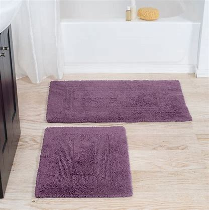

## pillar

[ˈpɪlər]

n.
柱，台柱，顶梁柱; 墩，柱脚; （组织、制度、信仰等的）核心

Now, the kelp industry here in Xiapu has become a pillar industry. 支柱产业

## phobia

[ˈfoʊbiə]

n.
恐惧; 厌恶

## prenup

['prinʌp]

n.
<美><口>婚前协议

## puffer fish

['pʌfər]

n.
河豚

## quarantine

[ˈkwɔːrəntiːn]

n.
检疫期，隔离期; 检疫所，隔离所; 四十天的时间

vt.
对…进行检疫; 隔离

She is at the hospital in quarantine. 她在医院被隔离

## rabid

[ˈræbɪd]

rabid dog 疯狗

## roll down

I really need some air. Alex, lower your window.

I really need some air. Alex, roll down your window.

The window on the green one is down 绿车窗未关

Do not roll down the window 不要摇下/打开车窗

Row the window down some more 把车窗再摇下一点

## roundabout

n.
交通环岛; 旋转木马; 旋转圆台

adj.
迂回的

## rug

[rʌɡ]

n.
小块地毯; 〈英〉（围盖膝的）围毯，车毯; 〈美俚男子假发

bathroom rugs

## silo

[ˈsaɪloʊ]

n.
筒仓; 发射井; 地下贮藏库; 青贮窖

## slimy

[ˈslaɪmi]

adj.
似黏液的; 黏滑的; <贬>谄媚的; 虚伪的

## smooth talker

能说会道

* sophisticated smooth talker —— 油嘴滑舌

## snowbird

热天北方，冬天南方的人

## soak

[soʊk]

vt.
浸泡，浸透; 吸入; 沉浸在（工作或学习中）; 湿透

## staycation

[ˌsteɪ'keɪʃn]

周遭游

## stretched thin

What does the expression “be stretched thin” mean? 

**Definition**: not have sufficient resources to carry out tasks, have too much work

**Example**: Our staff is really stretched thin at this time of year—lots of people are on 
vacation, but the workload doesn’t diminish.

## tortoise

[ˈtɔːrtəs]

n.
乌龟; 行动迟缓的人（或物）

## trim your nails

剪指甲

## tummy

[ˈtʌmi]

n.
<非正>胃，肚子

yummy in my tummy

## venomous snake

[ˈvɛnəməs]

毒蛇

## whiney

['waɪnɪ]

adj.
好发牢骚的，嘀咕不停的，烦躁的

habitually complaining
