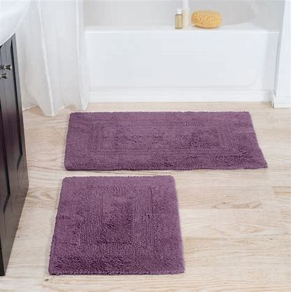

# R

## rabid

[ˈræbɪd]

rabid dog 疯狗

## rat race

内卷

It's the perfect serene escape from rat race. 此处的宁静让你暂时忘却内卷的世界。

## ravishing

[ˈrævɪʃɪŋ]

*adj.*
极其美丽的\
*v.*
使欣喜若狂，使着迷，使心醉( ravish的现在分词 )

You are looking particularly ravishing today. 今天你看起来令人销魂。

[大爆炸片段](https://www.ixigua.com/7064844033163690531)

## recap

[riˈkæp]

n.
胎面翻新的轮胎; 重述要点; <新闻>简明新闻\
vt.
翻新胎面；扼要重述

Recap of Lectures 1-3

## red zinger

红花 茶（一种水果茶）

## rehearsal

[rɪˈhɜːrsl]

Are you coming to the rehearsal with me? 你们要和我一起去彩排现场吗？\
Miss Waltham is at the rehearsal dinner. 华森小姐去排练婚礼餐会了。

[老友记片段](https://www.ixigua.com/7033656022572991012

## residence

[ˈrezɪdəns]

n.
住处，住宅; 居住时间，居住; 公馆; 驻地

The Waltham residence. 华森公馆

[老友记片段](https://www.ixigua.com/7033656022572991012

## retreat

[rɪˈtriːt]

vi.
撤退，后退; 撤销，作罢; （眼睛等）凹进; [航]向后倾斜

n.
撤回; 静居处; 引退期间; 静思，静修

So, the guys and I are talking about 
having kind of a science retreat this weekend. 这周末开一个科学静思会
[大爆炸片段](https://www.ixigua.com/7009152166753796621)

## rink / ice rink

[rɪŋk]

n.
溜冰场; 冰球场; （草地）木球场

## ritual

[ˈrɪtʃuəl]

n.
（宗教等的）仪式; 例行公事，老规矩; 典礼
adj.
作为仪式的一部分的; 礼节性的; 例行公事的

She says to break the bad boyfriend cycle ...
you can do like a cleansing ritual. 可以举行一个清理仪式

[老友记片段](https://www.ixigua.com/7013968814865908255)

## rock-paper-scissors

How about we go rock-paper-scissors? 要不我们来剪刀石头布？

## roll down

I really need some air. Alex, lower your window.

I really need some air. Alex, roll down your window.

The window on the green one is down 绿车窗未关

Do not roll down the window 不要摇下/打开车窗

Row the window down some more 把车窗再摇下一点

## root

[ruːt]

*intransitive verb*

1. to noisily applaud or encourage a contestant or team : CHEER
2. to wish the success of or lend support to someone or something

I was rooting for you. 我可是很看好你哦

[大爆炸片段](https://www.ixigua.com/7023331782909133319)

## roundabout

n.
交通环岛; 旋转木马; 旋转圆台

adj.
迂回的

## routine

[ruːˈtiːn]

n.
惯例，常规; 例程; 生活乏味; 一套动作
adj.
常规的; 日常的; 平常的; 乏味的

Sheldon, it's a routine procedure. 这只是常规手术

[大爆炸片段](https://www.ixigua.com/7014522943363351071)

## rug

[rʌɡ]

n.
小块地毯; 〈英〉（围盖膝的）围毯，车毯; 〈美俚男子假发

bathroom rugs

