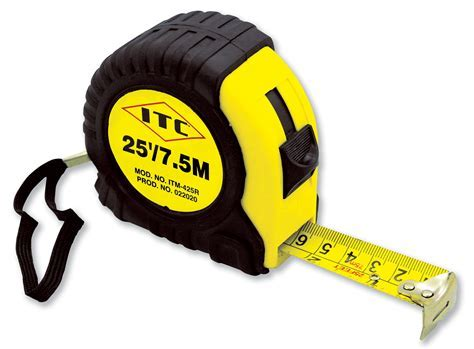
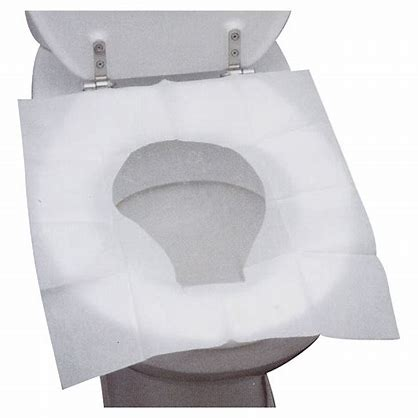
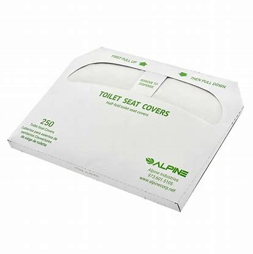

# S-Z

## sanitizer

['sænɪtaɪzə]

消毒杀菌剂

hand sanitizer 洗手液

## savory

['seɪvərɪ]

n.
（烹调用的）香薄荷\
adj.
好吃的; 体面的

She placed a huge dish before him of savory steaming meat. 她将一大盘热气腾腾、美味可口的肉放在他面前.

It's not fresh but it's very 不是很新鲜，但是很\
rich and savory like American style 厚油而丰富的美式风格

## savvy

[ˈsævi]

n.
机智; 头脑; 理解; 悟性
adj.
有见识的，懂实际知识的，通情达理的

tech savvy 精通技术, 技术大拿

## silo

[ˈsaɪloʊ]

n.
筒仓; 发射井; 地下贮藏库; 青贮窖

## sip

[sɪp]

n.
呷的动作; 一呷之量

vt.& vi.
小口喝，呷; 从…中呷吸

## slim to none

almost none

- "What are their chances of winning?" 
- "Slim to none."

## slimy

[ˈslaɪmi]

adj.
似黏液的; 黏滑的; <贬>谄媚的; 虚伪的

## slob

[slɑb]

n.
<口>懒汉，粗俗汉，笨蛋

## smooth talker

能说会道

* sophisticated smooth talker —— 油嘴滑舌

## sneak around

偷偷摸摸, 鬼鬼祟祟

I'm getting tired of sneaking around. 我不想再偷偷摸摸、鬼鬼祟祟了。

## snowbird

热天北方，冬天南方的人

## soak

[soʊk]

vt.
浸泡，浸透; 吸入; 沉浸在（工作或学习中）; 湿透

## squiggle

[ˈskwɪɡəl]

n.
歪扭或波形短线，难认的笔迹

## squint

[skwɪnt]

v.
斜视; 斜着眼睛看; 倾向; 瞇着眼睛看

n.
斜视; 一瞥

If I squint, I can pretend he's Alan Alda.

[老友记片段](https://www.ixigua.com/7003653369168560676)

## staycation

[ˌsteɪ'keɪʃn]

周遭游

## straighten up

[ˈstretn ʌp]

直起来；整理；收拾整齐

## stranded

[ˈstrændɪd]

adj.
处于困境的

v.
使滞留，使搁浅( strand的过去式和过去分词 )

Welcome back, we told you about a private community in Lycoming County last week that 
was pretty much stranded after a bridge gave out on their private road.

## stretched thin

What does the expression “be stretched thin” mean? 

**Definition**: not have sufficient resources to carry out tasks, have too much work

**Example**: Our staff is really stretched thin at this time of year—lots of people are on 
vacation, but the workload doesn’t diminish.

## surreal

[səˈriəl]

adj.
超现实的，离奇的

That was ... surreal. 听起来怪怪的

[老友记片段](https://www.ixigua.com/7025893776438592013)

## swindle

[ˈswɪndl]

vt.
诈骗，骗取; 欺骗，诓骗

n.
诈骗，骗取; 骗局; 冒牌货，冒名顶替者

You're a fraud, your profession is a **swindle**, 
and, uh, your livelihood is dependent on the gullibility of stupid people.

[大爆炸片段](https://www.ixigua.com/7004070526461149703)

## Tag, you're it

When little children are at school they play a game called "tig". Or "tag".

One person is "it" and all the other children try to keep away from them.

They will run around the field keeping away from the person who is "it" until finally the "it" person manages to touch one of them.

When he does he will say "Tig! You're it!"

And then the new "it" Will have to run around and try to touch one of the kids.

Extra Rule - **No Tag Backs**\
Sometimes the "it" will finally manage to "tag" a second kid after many exhausting minutes of chasing the whole class around, and that second kid will immediately tag them back and run away again.

How frustrating.

To stop this, the "no tag backs" rule was invented.

I play with the original rules though. Tag backs are just fine. :)

<https://hinative.com/en-US/questions/2815285>\
[大爆炸片段](https://www.ixigua.com/7024854238245159438) **注意Lenard碰了Penny一下**然后说的此话

## tape measure

卷尺

Hey, umm, do you guys have that tape measure?

## toilet seat protector sheet / toilet seat cover

## tortoise

[ˈtɔːrtəs]

n.
乌龟; 行动迟缓的人（或物）

## transcript

[ˈtrænskrɪpt]

n.
抄本; 誊本; 打印本; 学生成绩报告单

A transcript and audio of the segment are available online.

## traumatic

[traʊˈmætɪk]

adj.
<医>外伤的损伤的; 创伤的; 治外伤的

I think what we're all trying to say is, how traumatic the experience was for you

Divorce can be traumatic for everyone involved.

## trim your nails

剪指甲

## tummy

[ˈtʌmi]

n.
<非正>胃，肚子

yummy in my tummy

## twirl

[twɜrl]

vt.
（使）快速转动; （使）快速旋转; 扭动; 卷曲
n.
旋转，转动; 万能钥匙; 捻弄; 旋转的东西
vi.
旋转，转动

We want to see if they twirl their junk in the other direction.

[大爆炸片段](https://www.ixigua.com/7010030799319892493)

## urinate

[ˈjʊrəneɪt]

vi.
排尿，撒尿

I have to urinate

## venomous snake

[ˈvɛnəməs]

毒蛇

## vinegar

[ˈvɪnɪɡər]

n.
醋

Did they put vinegar inside? 放醋了吗？

## weenie

[ˈwini]

n.
[美国口语]]维也纳火腿肠; 给成功罩上阴影的东西; 蠢货[亦作 weeny, winie,wiener,ween]

## weirdo

[ˈwɪrdoʊ]

n.
古怪的人，奇怪的人

## whiney

['waɪnɪ]

adj.
好发牢骚的，嘀咕不停的，烦躁的，
喋喋不休

habitually complaining

## wig

[wɪɡ]

n.
假发，法官帽; 〈美俚〉知识分子

He disguised himself with a wig and false beard.

