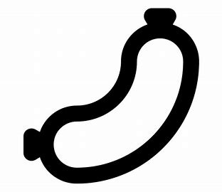

# S-Z

## silo

[ˈsaɪloʊ]

n.
筒仓; 发射井; 地下贮藏库; 青贮窖

## sip

[sɪp]

n.
呷的动作; 一呷之量

vt.& vi.
小口喝，呷; 从…中呷吸

## slimy

[ˈslaɪmi]

adj.
似黏液的; 黏滑的; <贬>谄媚的; 虚伪的

## smooth talker

能说会道

* sophisticated smooth talker —— 油嘴滑舌

## snowbird

热天北方，冬天南方的人

## soak

[soʊk]

vt.
浸泡，浸透; 吸入; 沉浸在（工作或学习中）; 湿透

## squint

[skwɪnt]

v.
斜视; 斜着眼睛看; 倾向; 瞇着眼睛看

n.
斜视; 一瞥

If I squint, I can pretend he's Alan Alda.

[老友记片段](https://www.ixigua.com/7003653369168560676?logTag=c4718f62014eb8f4f1e8)

## staycation

[ˌsteɪ'keɪʃn]

周遭游

## straighten up

[ˈstretn ʌp]

直起来；整理；收拾整齐

## stranded

[ˈstrændɪd]

adj.
处于困境的

v.
使滞留，使搁浅( strand的过去式和过去分词 )

Welcome back, we told you about a private community in Lycoming County last week that 
was pretty much stranded after a bridge gave out on their private road.

## stretched thin

What does the expression “be stretched thin” mean? 

**Definition**: not have sufficient resources to carry out tasks, have too much work

**Example**: Our staff is really stretched thin at this time of year—lots of people are on 
vacation, but the workload doesn’t diminish.

## swindle

[ˈswɪndl]

vt.
诈骗，骗取; 欺骗，诓骗

n.
诈骗，骗取; 骗局; 冒牌货，冒名顶替者

You're a fraud, your profession is a **swindle**, 
and, uh, your livelihood is dependent on the gullibility of stupid people.

[大爆炸片段](https://www.ixigua.com/7004070526461149703?logTag=7822b2fa4afd4e0e524b)

## tortoise

[ˈtɔːrtəs]

n.
乌龟; 行动迟缓的人（或物）

## traumatic

[traʊˈmætɪk]

adj.
<医>外伤的损伤的; 创伤的; 治外伤的

I think what we're all trying to say is, how traumatic the experience was for you

Divorce can be traumatic for everyone involved.

## trim your nails

剪指甲

## tummy

[ˈtʌmi]

n.
<非正>胃，肚子

yummy in my tummy

## urinate

[ˈjʊrəneɪt]

vi.
排尿，撒尿

I have to urinate

## venomous snake

[ˈvɛnəməs]

毒蛇

## weenie

[ˈwini]

n.
[美国口语]]维也纳火腿肠; 给成功罩上阴影的东西; 蠢货[亦作 weeny, winie,wiener,ween]

## whiney

['waɪnɪ]

adj.
好发牢骚的，嘀咕不停的，烦躁的

habitually complaining

## wig

[wɪɡ]

n.
假发，法官帽; 〈美俚〉知识分子

He disguised himself with a wig and false beard.

