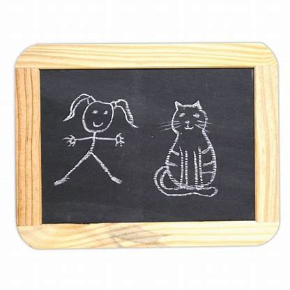
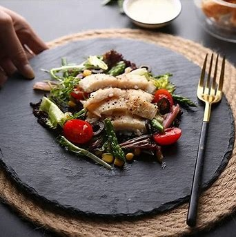
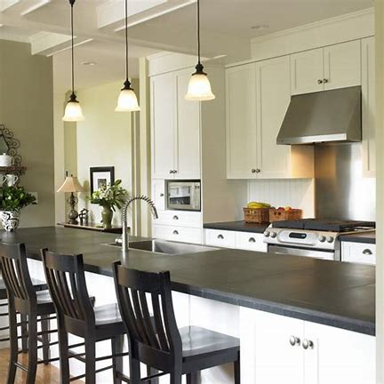
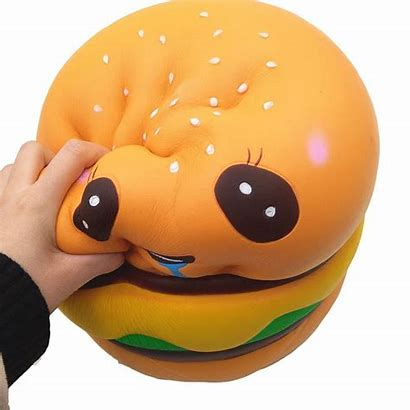

# S

## saliva

[səˈlaɪvə]

n.
唾液，口水; 津; 吐沫; 涎

Wow, my whole mouth just filled with saliva.

[老友记片段](https://www.ixigua.com/7051888411879473695)

## sanitizer

['sænɪtaɪzə]

消毒杀菌剂

hand sanitizer 洗手液

## sarcasm

[ˈsɑːrkæzəm]

*n.*
讥讽; 嘲讽; 反话

- This is sarcasm, not constructive criticism.\
这是讥讽, 不是善意的批评.
- Just when I think I've gotten the hang of sarcasm.\
我还当是我掌握到了挖苦的窍门呢。

## Saturn

[ˈsætɜːrn]

*n.*
土星

## savory

['seɪvərɪ]

n.
（烹调用的）香薄荷\
adj.
好吃的; 体面的

She placed a huge dish before him of savory steaming meat. 她将一大盘热气腾腾、美味可口的肉放在他面前.

It's not fresh but it's very 不是很新鲜，但是很\
rich and savory like American style 厚油而丰富的美式风格

## savvy

[ˈsævi]

*n.*
    机智; 头脑; 理解; 悟性\
*adj.*
    有见识的，懂实际知识的，通情达理的

tech savvy 精通技术, 技术大拿

## scrappy

[ˈskræpi]

*adj.*
混乱的; 散乱的; <美>好斗的; 好吵架的

- You're also so generous and kind and scrappy!
\
你现在还很慷慨,善良,斗志旺盛!

## screen

[skriːn]

*n.*
屏幕; 银幕; 电影; 屏风; 掩蔽物; 纱门; 围屏\
*v.*
放映; 遮挡; 包庇; 检查; **筛选**; 转接

If you're listening to this message, we're probably screening. 
如果你听到这个留言，那很可能是我们的筛选电话。

## come to one's sense

醒悟，想明白，恢复理智；苏醒过来

I'm sure she'll come to her senses and pick you. 她肯定会醒悟过来选你的。

## serene

[səˈriːn]

*adj.*
沉静的，宁静的，安宁的; 安详的; 晴朗的; 清澈的

- It's the perfect serene escape from rat race. 此处的宁静让你暂时忘却内卷的世界。

## shades

[ʃeɪdz]

*n.*	
墨镜；夜幕；
阴凉处; 背阴; (树)荫; 灯罩; 浓淡深浅; 色度;

- Nice shades. 太阳镜很酷啊。
- Thanks.

## shine

be very talented or perform very well:

- she shines at comedy
- That doesn't seem to be where I shine. 貌似那不是我的强项。

## shrink

[ʃrɪŋk]

*n.* 心理医生

- My shrink just killed himself and blamed me in the note. 我的心理医生自杀了，还留下纸条说都怪我。

## silo

[ˈsaɪloʊ]

n.
筒仓; 发射井; 地下贮藏库; 青贮窖

## simp

[sɪmp]

*n.*
笨人

- king of simp 舔狗之王

## sip

[sɪp]

n.
呷的动作; 一呷之量

vt.& vi.
小口喝，呷; 从…中呷吸

I'll just take one last sip. 那我喝最后一口。

[大爆炸片段](https://www.ixigua.com/7053757808293970462)

## skinny

[ˈskɪni]

*adj.*
极瘦的，皮包骨的; 紧身的; 小气的; 皮的，皮质的\
*n.*
（不公开的）信息；内幕消息

Easy for you to say, skinny bitch. 说起来倒容易，你个瘦皮猴

[大爆炸片段](https://www.ixigua.com/7053424288761643551)

## slate board

## slate board food server

## slate countertop

## sleep tight

Sleep well. A phrase said to someone when they are going to sleep.
- I think I'm going to head to bed." B: "
- OK, sleep tight! See you in the morning.
- Good night, sweetheart, sleep tight!

to sleep warm and safe. (Usually said with good night to someone going to bed.) 
- sleep tight, Bobby. See you in the morning.

(informal, spoken) used especially to children before they go to bed to say 
that you hope they sleep well: 
- Good night, Pat, sleep tight!

## city slicker

[ˈsɪti ˈslɪkɚ]

*n.*
<美口>时髦或世故的城市人

- Pudding is a city slicker. （狗狗）布丁是个城市娃娃。
- That city slicker was out of his element out on the farm.
\
那个城市佬在农场里是如鱼离水,不得其所.

## slim to none

almost none

- "What are their chances of winning?" 
- "Slim to none."

## slimy

[ˈslaɪmi]

adj.
似黏液的; 黏滑的; <贬>谄媚的; 虚伪的

- Tasted like a slimy piece of fish. 尝起来象滑溜溜的小鱼

## slob

[slɑb]

n.
<口>懒汉，粗俗汉，笨蛋

## smooth talker

能说会道

* sophisticated smooth talker —— 油嘴滑舌

## snack

小吃

## sneak around

偷偷摸摸, 鬼鬼祟祟

- I'm getting tired of sneaking around. 我不想再偷偷摸摸、鬼鬼祟祟了。

## snippy

[ˈsnɪpi]

*ADJECTIVE*
*informal*
NORTH AMERICAN

curt or sharp, especially in a condescending way

- a snippy note from our landlord
- Cindy had been more than usually snippy.
\
辛迪异乎寻常的出言不逊.
- I'm sorry I got snippy.
\
很抱歉,刚才我有些急躁.

## snob

[snɑːb]

*n.*
势利小人，势利眼; 附庸风雅之徒，假内行

- I really I'm kind of a coffee snob. 我的确是个在咖啡上穷讲究的人
- ...a first class food snob. 自认为饮食方面品位一流的家伙

## snowbird

热天北方，冬天南方的人

## soak

[soʊk]

vt.
浸泡，浸透; 吸入; 沉浸在（工作或学习中）; 湿透

## squat potty

蹲坑

## squiggle

[ˈskwɪɡəl]

n.
歪扭或波形短线，难认的笔迹

## squishy

[ˈskwɪʃi]

*adj.*
soft and moist.

- the bananas will turn soft and squishy 
- the road is a sluice of squishy mud

## squint

[skwɪnt]

v.
斜视; 斜着眼睛看; 倾向; 瞇着眼睛看

n.
斜视; 一瞥

If I squint, I can pretend he's Alan Alda.

[老友记片段](https://www.ixigua.com/7003653369168560676)

## stake

[steɪk]

*n.* \
the amount of money that you risk on the result of a game or competition:
- What stakes do you propose? 赌什么？
- Almost everyone has a stake in the global economy these days.
- She spent two weeks in Las Vegas playing high-stakes blackjack at the casinos.

*n.* \
a share or a financial involvement in something such as a business:
- He holds (= owns) a 40 percent stake in/of the company.
- He has no financial stake in the company.
- They had planned to buy a 20 percent stake in the company.
- He left his wife and family a 38 percent stake in the largest store group in the world.

[wager](u-z.md#wager)

## staycation

[ˌsteɪ'keɪʃn]

周遭游

## steamy

[ˈstimi]

*adj.*
蒸汽的，充满水汽的; 雾重的，潮湿的; 色情的\
1. Filled with or emitting steam: a steamy bathroom.
2. Hot and humid; muggy: a steamy summer afternoon.
3. Erotic: a steamy striptease.

- It's actually steamier than it looks. 其实现实比看上去色情多了。
- Fans may have been expecting more steamy scenes between the pair 
after watching season 1 of Bridgerton which chronicled the 
relationship between Daphne (Phoebe Dynevor) and Simon (Regé Jean-Page).

## stooge

[studʒ]

*n.*
走狗。喜剧里的配角或丑角，助手，伙伴

- I'd play stooge to him in the performance.
\
在表演中我来给他当作配角.
- The charge that Harding was a political stooge may be a canard.
\
关于哈丁是个政治走狗的指控可能是个谣传。

## straighten up

[ˈstretn ʌp]

直起来；整理；收拾整齐

## stranded

[ˈstrændɪd]

adj.
处于困境的

v.
使滞留，使搁浅( strand的过去式和过去分词 )

Welcome back, we told you about a private community in Lycoming County last week that 
was pretty much stranded after a bridge gave out on their private road.

## stretched thin

What does the expression “be stretched thin” mean? 

**Definition**: not have sufficient resources to carry out tasks, have too much work

**Example**: Our staff is really stretched thin at this time of year—lots of people are on 
vacation, but the workload doesn’t diminish.

## styrofoam

['staɪrəfoʊm]

n.
泡沫聚苯乙烯

## suger-daddy, suger-baby, and uncle suger = uncle Sam

糖爸，糖宝宝，山姆大叔（美国政府）

## super-ager

不老者，青春永驻者

[What makes a cognitive super-ager?](https://www.health.harvard.edu/healthy-aging/what-does-it-take-to-be-a-super-ager)
\
Dr. Bradford Dickerson, a neurologist at Harvard-affiliated 
Massachusetts General Hospital and his colleagues have been studying 
super-agers for several years. Their results suggest that embracing 
new mental challenges may be the key to preserving both brain tissue 
and brain function.

In one study, 81 healthy adults — 40 of whom were 60 to 80 years old 
and 41 of whom were 18 to 35 — were read a list of 16 nouns six times. 
Twenty minutes later, they were asked to recall as many of the words 
as possible. While 23 of the older participants recalled nine or 
fewer words, a score considered average for their age group, 17 
seniors — the super-agers — could remember 14 words or more, a score 
similar to that of the younger participants.

## superstition

[ˌsuːpərˈstɪʃn]

*n.*
迷信; 迷信行为

- That sounds like a silly superstition.

## surreal

[səˈriəl]

adj.
超现实的，离奇的

That was ... surreal. 听起来怪怪的

[老友记片段](https://www.ixigua.com/7025893776438592013)

## swindle

[ˈswɪndl]

vt.
诈骗，骗取; 欺骗，诓骗

n.
诈骗，骗取; 骗局; 冒牌货，冒名顶替者

You're a fraud, your profession is a **swindle**, 
and, uh, your livelihood is dependent on the gullibility of stupid people.

[大爆炸片段](https://www.ixigua.com/7004070526461149703)

