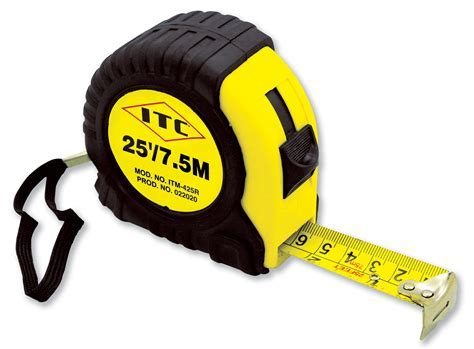
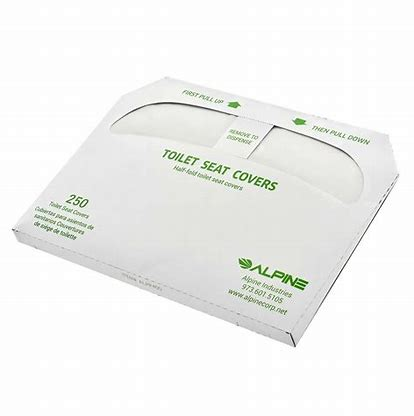

# T

## Tag, you're it

When little children are at school they play a game called "tig". Or "tag".

One person is "it" and all the other children try to keep away from them.

They will run around the field keeping away from the person who is "it" until finally the "it" person manages to touch one of them.

When he does he will say "Tig! You're it!"

And then the new "it" Will have to run around and try to touch one of the kids.

Extra Rule - **No Tag Backs**\
Sometimes the "it" will finally manage to "tag" a second kid after many exhausting minutes of chasing the whole class around, and that second kid will immediately tag them back and run away again.

How frustrating.

To stop this, the "no tag backs" rule was invented.

I play with the original rules though. Tag backs are just fine. :)

<https://hinative.com/en-US/questions/2815285>\
[大爆炸片段](https://www.ixigua.com/7024854238245159438) **注意Lenard碰了Penny一下**然后说的此话

## tails

*n.*
(抛硬币时)硬币的背面（正面是 heads）; \
（非正式）燕尾服; 男子夜礼服; \
 尾( tail的名词复数 ); 尾部; 燕尾服; 尾随者

- Somebody call it this time. 拜托谁猜一下（正反面）。
- Tails! 反面
- It's heads. 是正面

[老友记片段](https://www.ixigua.com/7054528337271915015)

## tantrum

[ˈtæntrəm]

*n.*
an uncontrolled outburst of anger and frustration, typically in a young child.

*synonyms*:
fit of temper · fit of rage · fit of pique · fit · 
outburst · flare-up · blowup · pet · paroxysm · frenzy · 
bad mood · mood · huff · scene · mard · shit fit

- he has temper tantrums if he can't get his own way

## tape measure

卷尺

Hey, umm, do you guys have that tape measure?

## taro

['tɑroʊ]

芋头

## terabyte

[ˈtɛrəˌbaɪt]

- Did the guy make sure 那伙计有没有\
that this has a one-terabyte solid-state drive? 确保这台是有 1TB 固态硬盘的呢

[大爆炸片段](https://www.ixigua.com/7056301385033187847)

## thereof

ADVERB
formal

of the thing just mentioned; of that.
- the member state or a part thereof
- ...a charge of £20 per hour or part thereof.\
一小时或不足一小时收费 20 英镑

## thunderbolt port

雷电接口

[大爆炸片段](https://www.ixigua.com/7056301385033187847)

## tinkle

[ˈtɪŋkəl]

尿尿

*vt.& vi.*
（使）发出丁当声，（使）发铃铃声\
*vt.*
叮当响着发出，铃铃响着报出\
*n.*
丁当声，铃铃声; <英><口>一次电话

- Oh, dear! I have to tinkle again. 妈呀！又要尿尿了。

## tissue

*n.*
(动植物的)组织; 薄纸; 面巾纸

- muscle/brain/nerve, etc. tissue
\
肌肉、大脑、神经等组织

## toilet seat protector sheet / toilet seat cover

## toning

['toʊnɪŋ]

*n.*
调色（法），相片调色，调匀颜色; 调音

- all-over toning 全身调理
- Mix up cardio and weights throughout the week for **all-over toning** and general health.

## toothpick

[ˈtuθˌpɪk]

*n.*
牙签

## top-notch

[ˌtäpˈnäCH]

*ADJECTIVE*
informal\
of the highest quality; excellent.
- a top-notch hotel
- their work was top-notch

## top-shelf

\ ˈtäp-ˈshelf \

1. : of the best quality \
    // top-shelf products \
    // Reading does have one top-shelf tourist attraction, a gorgeous pagoda that sits atop a mountain.\
    — Joe Queenan
2. [from the placement of sexually explicit magazines for sale on high shelves out of the reach 
    of children] British : containing pornographic material \
    // top-shelf magazines
    // This year, retailers are going to come under increased pressure to clean up their acts. 
    Of course, they're not obliged to sell top-shelf mags. \
    — The Grocer

## tortoise

[ˈtɔːrtəs]

n.
乌龟; 行动迟缓的人（或物）

## toss

[tɔːs]

*vt.& vi.*
扔，抛; （使）摇荡; 摇匀; 掷硬币决定\
*n.*
掷硬币决定; 向上甩头; 猛仰头（尤指表示恼怒或不耐烦）; （尤指比赛或游戏中）投掷

Do it. Visualize it as your anger 扔吧。把它想象成你的愤怒，
and toss it out of your life. 然后用力将其扔出你的人生。

## transcript

[ˈtrænskrɪpt]

n.
抄本; 誊本; 打印本; 学生成绩报告单

A transcript and audio of the segment are available online.

## traumatic

[traʊˈmætɪk]

adj.
<医>外伤的损伤的; 创伤的; 治外伤的

- I think what we're all trying to say is, how traumatic the experience was for you
- Divorce can be traumatic for everyone involved.

## trilogy

[ˈtrɪlədʒi]

*n.*
（小说、戏剧、音乐等的）三部曲

## trim your nails

剪指甲

## troll

（网络）喷子

[What Is an Internet Troll? (and How to Handle Trolls)](https://www.howtogeek.com/465416/what-is-an-internet-troll-and-how-to-handle-trolls/)

## tummy

[ˈtʌmi]

n.
<非正>胃，肚子

yummy in my tummy

## turn in

[tɚn ɪn]

上床睡觉; 上交; 归还; 面向内

## twirl

[twɜrl]

vt.
（使）快速转动; （使）快速旋转; 扭动; 卷曲
n.
旋转，转动; 万能钥匙; 捻弄; 旋转的东西
vi.
旋转，转动

We want to see if they twirl their junk in the other direction.

[大爆炸片段](https://www.ixigua.com/7010030799319892493)

