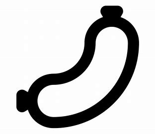

# U-Z

## urinate

[ˈjʊrəneɪt]

vi.
排尿，撒尿

I have to urinate

## venomous snake

[ˈvɛnəməs]

毒蛇

## vest

[vest]

*n.*
马甲; 防护衣; 内衣; （印有运动员编号的）运动背心

## veteran

[ˈvetərən]

*n.*
经验丰富的人，老兵; 退伍军人

The veteran teacher accumulated rich teaching experiences.
\
那位老教师积累了丰富的教学经验.

## veterinarian / vet

[ˌvetərɪˈneriən]

n.
<正>兽医

## viable

[ˈvaɪəbl]

*adj.*
capable of working successfully; feasible.

- If this is a viable thing, we could get a patent. 如果真可行

[大爆炸片段](https://www.ixigua.com/7053757808293970462)

## vinegar

[ˈvɪnɪɡər]

n.
醋

Did they put vinegar inside? 放醋了吗？

## wack

[wæk]

*slang* Really bad or undesirable.

That movie was really wack.\
It's wack, the worst ever. 太垃圾了，史上最烂。

## wager

[ˈwedʒɚ]

*n.* 
赌金，赌注; 赌物; 赌博 \
*vt.& vi.*
打赌; 担保，保证 \
*vt.*
保证，担保; 下赌注

- All right, you have a wager.
- I have lose the wager.

[stake](s.md#stake)

## wasted

喝醉了，喝高了

He's so wasted. 他真喝高了。

## weenie

[ˈwini]

n.
[美国口语]]维也纳火腿肠; 给成功罩上阴影的东西; 蠢货[亦作 weeny, winie,wiener,ween]

## weirdo

[ˈwɪrdoʊ]

n.
古怪的人，奇怪的人

## what'cha been doin'

What have you been doing?

## what'cha talking about

What are you talking about?

## what'cha think

What do you think?

## whiney

['waɪnɪ]

adj.
好发牢骚的，嘀咕不停的，烦躁的，
喋喋不休

habitually complaining

## wig

[wɪɡ]

n.
假发，法官帽; 〈美俚〉知识分子

He disguised himself with a wig and false beard.

## whoopee

[ˈhwʊpi, ˈwʊpi, ˈhwupi, ˈwu-]

*int.*
表示兴奋激动的心情时的叫声\
好爽啊！

- I can have a lie in tomorrow. Whoopee!
\
我明天能睡懒觉了，哈哈！

## workaday

[ˈwɜrkədeɪ]

*adj.*
普通的，平凡的，枯燥乏味的

- What are the odds that two individuals 有多大的几率把两个 \
as unique as ourselves would be connected  像我们这么独特的人给联系上， \
by someone as comparatively **workaday** as your son? 
但却要通过象你儿子那样相对平凡的人？

## workaround

[ˈwɜrkəraʊnd]

*n.*
工作区; 应变方法；变通方法

## workshop

[ˈwɜːrkʃɑːp]

n.
工坊。车间; 研讨会

- mahjong workshop 麻将工坊
- jianbing workshop 煎饼工坊
- carpentry workshop 木匠工坊
- kids workshop

## yak

[jæk]

*n.*
牦牛; 笑话\
*vi.*
<非正，贬>没完没了地谈些无关要紧的事，喋喋不休，唠叨
